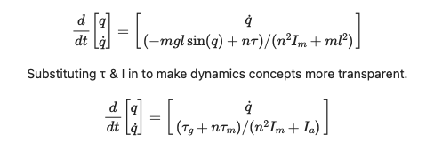
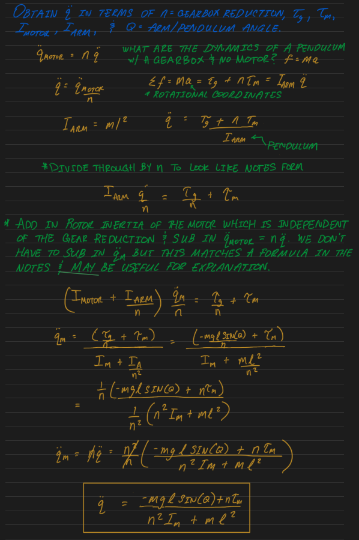

# Manipulation

---

## What is robotic manipulation?

Robotic manipulation refers to the way robots interact with the open world around them. It is infinitely more complicated that just grasping objects or the pick & place task. This [review paper by Matthew Mason](https://www.cs.cmu.edu/afs/cs/academic/class/16741-s07/www/Mason2018.pdf) describes robotic manipulation exhaustively (via [Russ Tedrake's Manipulation Course](https://manipulation.mit.edu/index.html)).

## Why do we predominantly address robotic manipulation from the kinematics perspective?

There is a fundamentally important concept to understand w.r.t robot manipulation expressed in an early [exercise](https://github.com/robotics-exploration/manipulation/blob/master/book/robot/exercises/01_reflected_inertia.ipynb) of [Tedrake's course](https://manipulation.mit.edu/index.html), i.e. motors with gear reductions change the dynamics of control from direct drive state-space dynamics, in which torque due to gravity & the inertia of the arm (e.g.) play important parts in determining state over time, to gearbox influenced dynamics, in which the torque of the motor & its rotary inertia dominate the dynamics & therefore turn the motor torque control input into an excellent mechanism of control. The following equations illustrate this:

Insight is available by analysis of the state-space dynamics equation for the pendulum driven by the motor with a gearbox. Where n=1, we model a direct drive system with no gearbox, & we have a numerater with equal weight given to &tau;_g & &tau;_m & a denominator which equally weights &Iota;_m & &Iota;_a, i.e. no term dominates & control is more complicated. V.S. letting n be >1 which causes the torque of the motor to dominate the numerator & the rotor inertia of the motor to dominate the denominator, i.e.; the dynamics of the motor begin to dominate the overal dynamics of the system leading to more simple control. The derivation of the equations above is as follows.

