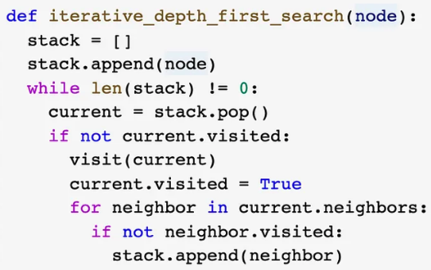
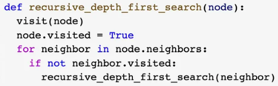

# Depth-First Search

---
DFS is a graph search algorithm whose frontier is kept on a FIFO queue to ensure that the deepest nodes are all explored first which comes with the guarantee that given enough time BFS always find the solution if it exists. DFS returns the first solution it finds with no guarantee of optimality. Time complexity is a function of the size of the branching factor & depth of the search graph, i.e. O(b^d), but space complexity is an improvement over BFS, only requires O(bm) where m is the max depth of the search tree.

## Algorithm

DFS is the same as [[20240226-074659-breadth-first-search#breadth-first-search|Breadth-First Search ❯ Breadth-First Search]] except that it utilizes a FIFO queue for the frontier which leads to gaining depth first instead of the shallow exploration of BFS. See BFS by the link above for the algorithm or see below for a simple python implementation.


There is also a commonly useful recursive implementation of depth first search.


## problems

- [ ] [[#pacman grid world]]
- [ ] [[#universal sink]]
- [ ] [[#is graph a valid tree?]]
- [ ] [[#binary tree maximum path sum]]
- [ ] [[#binary tree inorder traversal]]
- [ ] [[#binary tree postorder traversal]]
- [ ] [[#Minimum Fuel Cost to Report to the Capital]]
- [ ] Find the source nodes.
- [ ] Topological Sort
- [ ] Strongly Connected Components
- [ ] Find the sink nodes.
&nbsp;

# PacMan Grid World

---
Given a grid of dimension R x C, the locations of PacMan, the food, & the string based grid world; implement a function that performs DFS, printing out the number of nodes expanded on the first line followed by each node visited "R C" on each following line. Include the initial problem state. The expansion of a node should order its children UP, LEFT, RIGHT, DOWN where they exist.

```text
                            11 9
                            2 15
                            13 20
                            %%%%%%%%%%%%%%%%%%%%
                            %----%--------%----%
                            %-%%-%-%%--%%-%.%%-%
                            %-%-----%--%-----%-%
                            %-%-%%-%%--%%-%%-%-%
                            %-----------%-%----%
                            %-%----%%%%%%-%--%-%
                            %-%----%----%-%--%-%
                            %-%----%-%%%%-%--%-%
                            %-%-----------%--%-%
                            %-%%-%-%%%%%%-%-%%-%
                            %----%---P----%----%
                            %%%%%%%%%%%%%%%%%%%%

```

## Explore

The instruction is explicit, we're implementing DFS. The following tree has nodes numbered by the order they would be explored by the DFS algorithm.

                   ┌───┐             DFS runs on graphs other than trees. One
                   │ 1 │             must keep track of which nodes have been 
                   └─┬─┘             explored & avoid them.    E.g.
              ┌──────┼──────┐
              ▼      ▼      ▼                      ┌──────┐
            ┌───┐  ┌───┐  ┌───┐                    │      ▼
            │ 2 │  │ 4 │  │ 5 │                  ┌─┴─┐  ┌───┐  ┌───┐  
            └─┬─┘  └───┘  └─┬─┘                  │ 2 │◄─┤ 1 ├─►│ 4 │
              │          ┌──┴──┐                 └─┬─┘  └───┘  └───┘
              ▼          ▼     ▼                   ▼
            ┌───┐      ┌───┐ ┌───┐               ┌───┐  
            │ 3 │      │ 6 │ │ 7 │               │ 3 │
            └───┘      └─┬─┘ └───┘               └───┘
                         ▼                       
                      ┌───┐         In other search algorithms, the shortest 
                      │ 8 │         path discovered so far must be kept track
                      └───┘         of & compared against rediscoveries.     

## Python Solution

```python
import os
from dataclasses import dataclass
from collections import deque
from typing import Optional, List


MOVES = [(-1, 0), (0, -1), (0, 1), (1, 0)]
GOAL = "."
OBSTACLES = {"%"}


@dataclass(frozen=True, eq=True)
class Node:
    row: int
    col: int
    value: str


def is_goal(node) -> bool:
    return node.value == GOAL


def print_solution(visits):
    print(len(visits))
    for node in visits:
        print(f"{node.row} {node.col}")


def expand(node, grid):
    for i, j in MOVES:
        r = node.row + i
        c = node.col + j
        if 0 <= r < len(grid) and 0 <= c < len(grid[0]) and grid[r][c] not in OBSTACLES:
            yield Node(r, c, grid[r][c])


def next_move(nr, nc, pr, pc, fr, fc, grid):
    start = Node(pr, pc, grid[pr][pc])
    frontier = deque([start])
    explored = {start}
    visits = []

    while frontier:
        current = frontier.popleft()
        explored.add(current)
        visits.append(current)
        if is_goal(current):
            break

        for child in expand(current, grid):
            if child not in explored:
                frontier.append(child)

    print_solution(visits)
    return


def get_input():
    pr, pc = list(map(int, input().split()))
    fr, fc = list(map(int, input().split()))
    n, m = list(map(int, input().split()))

    grid = []
    for i in range(0, n):
        grid.append(list(map(str, input())))

    return n, m, pr, pc, fr, fc, grid


next_move(*get_input())
```

## Complexity Analysis

If each state has at most 3 successor states, then our time complexity of O(3^d) where d is the depth of search tree through the grid. For each node we store a constant amount of information yielding a space complexity of O(3^d). Here, three is known as the branching factor, which as you can imagine becomes quickly unwieldy as depth increases.

## C++ Solution

TODO: c++ solution

```cpp
#include <iostream>
#include <vector>
#include <sstream>
#include <queue>
#include <unordered_map>
using namespace std;

struct Node {
  char data;
  pair<int, int> coordinates;
};

char OPEN = '-';
char WALL = '%';
char FOOD = '.';
char PACMAN = 'P';

vector<pair<int, int>> moves = {
  make_pair(-1, 0),
  make_pair(0, -1),
  make_pair(0, 1),
  make_pair(1, 0)
};

string get_coord_string(pair<int, int> coordinates) {
    return to_string(coordinates.first) + '_' + to_string(coordinates.second);
}

vector<Node> expand(Node node, vector<string> grid, int r, int c) {
  vector<Node> children;
  for (pair<int, int> move : moves) {
    int r_move = node.coordinates.first + move.first;
    int c_move = node.coordinates.second + move.second;
    if (0 <= r_move && r_move < r && 0 <= c_move && c_move < c && grid[r_move][c_move] != WALL) {
      struct Node child = { grid[r_move][c_move], make_pair(r_move, c_move) };
      children.push_back(child);
    }
  }
  return children;
}

void nextMove( int r, int c, int pacman_r, int pacman_c, int food_r, int food_c, vector <string> grid){
  if (grid[pacman_r][pacman_c] == FOOD) {
    cout << 1 << endl;
    cout << pacman_r << ' ' << pacman_c << endl;
    return;
  }
  
  stringstream ss;
  queue<Node> frontier;
  struct Node start = { PACMAN, make_pair(pacman_r, pacman_c) };
  frontier.push(start);
  unordered_map<string, Node> reached;
  reached[get_coord_string(start.coordinates)] = start;

  while (!frontier.empty()) {
    Node current = frontier.front();
    frontier.pop();
    for (Node child : expand(current, grid, r, c)) {
      if (reached.find(get_coord_string(child.coordinates)) != reached.end()) {
        ss << child.coordinates.first << ' ' << child.coordinates.second << endl;
        if ( child.data == FOOD ) {
          cout << reached.size() + 1 << endl;
          cout << ss.str();
        }
        reached[get_coord_string(child.coordinates)] = child;
        frontier.push(child);
      }
    }
  }
  return; //failed to find food
}

int main(void) {

    int r,c, pacman_r, pacman_c, food_r, food_c;
    
    cin >> pacman_r >> pacman_c;
    cin >> food_r >> food_c;
    cin >> r >> c;
    vector <string> grid;

    for(int i=0; i<r; i++) {
        string s; cin >> s;
        grid.push_back(s);
    }

    nextMove( r, c, pacman_r, pacman_c, food_r, food_c, grid);

    return 0;
}

```

&nbsp;

# Universal Sink

---
Given a list of people & a function that returns whether a knows b, find the person everyone knows & who knows nobody else, i.e. the celebrity, if one exists, else return -1.

## Explore

- [ ] TODO

## Python Solution

```python
# def knows(a: int, b: int) -> bool:
class Solution:
    def findCelebrity(self, n: int) -> int:
        sink = self.dfs(0, 0, n)
        return sink if self.universal_sink(sink, n) else -1

    def dfs(self, i, j, n) -> int:
        if j == n:
            return i

        if knows(i, j):
            return self.dfs(j, j + 1, n)
        else:
            return self.dfs(i, j + 1, n)

    def universal_sink(self, sink, n) -> bool:
        for i in range(n):
            if i == sink:
                continue
            if not knows(i, sink) or knows(sink, i):
                return False
        return True
```

## Complexity Analysis

This is O(n) time & space because we are ignoring edges the go backwards in the graph. This linearises the graph, so this is a linear search.
&nbsp;

# Is Graph a Valid Tree?

---
Given a list of edges, check to see if it describes a valid tree.

## Explore

The idea is to run DFS on the graph & check to see if any node is seen twice. If so, then the graph is not a valid tree. We are given a list of edges & therefore must construct our graph, we'll use an adjacency list to do so.

## Python Solution

```python
class Solution:
    def validTree(self, n: int, edges: List[List[int]]) -> bool:
        if len(edges) != n - 1:
            return False
        if not edges:
            return True

        graph = {}
        for e in edges:
            if e[0] not in graph:
                graph[e[0]] = []
            if e[1] not in graph:
                graph[e[1]] = []

            graph[e[0]].append(e[1])
            graph[e[1]].append(e[0])

        frontier = [edges[0][0]]  # for DFS, it's fine to use a list|stack
        visited = {edges[0][0]: -1}  # instead of a queue use dict this time to
        # keep track of where the visit was from we choose the first node
        # arbitrarily to start from (-1)

        def get_neighbors(node, graph, visited):
            for n in graph[node]:
                if n == visited[node]:  # in an undirected graph, there may be
                    continue  # an edge from a->b & from b->a, we want to treat
                yield n  # those as one edge as we are generating neighbors
                # (i.e. parents aren't neighbors here)

        while frontier:
            node = frontier.pop()
            for neighbor in get_neighbors(node, graph, visited):
                if neighbor in visited:
                    return False
                visited[neighbor] = node  # visit from where?
                frontier.append(neighbor)

        # we could still have a graph with unconnected components & in our case
        return len(visited) == n  # do not want to treat it as a valid tree
```

&nbsp;

# Binary Tree Maximum Path Sum

---

Given the root node of binary tree, determine the maximum path sum between any two nodes.

## Explore

              -10
         ┌────────────┐
         ▼            ▼
         9           20
                ┌───────────┐
                ▼           ▼
               15           7
                   -> 42

1. Recurse to the deepest node & calculate the mps. The mps on a leaf node is the value of that node. Continue calculating mps as you recurse back up the stack. The mps for a 3 node binary subtree is mps(left) + mps(right) + self. This is analogous to depth first search.

## Python Solution

```python
from sys import maxsize


class Solution:
    mps: int = -maxsize

    def dfs(self, root) -> int:
        if root is None:
            return 0

        mpsl = max(0, self.dfs(root.left))
        mpsr = max(0, self.dfs(root.right))

        cmps = mpsl + mpsr + root.val
        self.mps = max(self.mps, cmps)

        return root.val + max(mpsl, mpsr)

    def max_path_sum(self, root) -> int:
        self.dfs(root)
        return self.mps
```

## Complexity

We traverse the tree by recursive [[20240226-070949-depth-first-search#depth-first-search|depth first search]] in linear time, O(V), using constant, O(1), space to keep track of our maximum path sum.

&nbsp;

# Binary Tree Inorder Traversal

---
Given the root of a binary tree, return the node values corresponding to its inorder traversal.

## Python Solution

```python
class Solution:
    def m(self, root) -> List[int]:
        if root is None:
            return []

        l = self.m(root.left)
        r = self.m(root.right)

        return l + [root.val] + r
```

## Complexity

DFS is O(v+e) but we have a binary tree which has 2^h nodes at any height & there 2^(h+1) total nodes where h is the highest level. This implies that the height of the tree is logv & there are 2^logv = v nodes which is O(v) time. An easier way to see this is that a binary tree has one edge for every node except the root node -> O(v+v-1) -> O(v). We use O(logv) space for the recursion where logv is the height of the tree.

&nbsp;

# Binary Tree Postorder Traversal

---
Given the root of a binary tree, return the node values corresponding to the postorder traversal.

## Explore

          5

       1     4

           2    3

1. Postorder traversal of a binary tree is DFS with a left, right, root ordering.

## Python Solution

```python
class Solution:
    def m(self, root) -> List[int]:
        # edge cases: root is null
        if root is None:
            return []

        l = self.m(root.left)
        r = self.m(root.right)

        return l + r + [root.val]
```

## Complexity

DFS on a binary tree is O(logv) time where logv is the height of the tree, & O(logv) space on the stack from the recursion.

&nbsp;

# Minimum Fuel Cost to Report to the Capital

---
Given a list of roads, each road a list of 2 ends, integers that correspond to cities, & the number of seats per car, output the minimum fuel cost it takes to get a representative from every city to the capital, city#=0. Each city has a representative, each representative has a car with the given number of seats, each road costs 1 unit of fuel per car to traverse, & representatives may ride together if they end up in the same city.

## Explore

            2


           0     s=2


       1       3       4        5

1. DFS
2. Keep track of the running cost of travel. Calculate the cost at each node by dividing the number of representatives at a city by the number of seats & take the ceiling to find the number of cars that have to be taken, i.e. the fuel cost to go one step closer to the capital.
3. Return the list of travelers between cities at each step for use in the calculation at the next city.

## Python Solution

```python
from math import ceil
from dataclasses import dataclass, field


@dataclass
class Node:
    city: int
    neighbors: list = field(default_factory=list)


class Solution:
    def minimumFuelCost(self, roads, seats) -> int:
        # TODO: try adjacency list implementation.
        cities = {}
        for road in roads:
            start, end = road
            if start not in cities:
                cities[start] = Node(start)
            if end not in cities:
                cities[end] = Node(end)

            cities[start].neighbors += [cities[end]]
            cities[end].neighbors += [cities[start]]

        visited = set()
        cost = 0

        def dfs(node) -> list:
            nonlocal cost
            visited.add(node.city)
            representatives = [node.city]
            for neighbor in node.neighbors:
                if neighbor.city in visited:
                    continue
                representatives += dfs(neighbor)

            # don't count the capital.
            if node.city != 0:
                cost += ceil(len(representatives) / seats)
            return representatives

        # if no roads or no capital, then no cost.
        capital = 0
        if capital not in cities:
            return 0

        dfs(cities[capital])
        return cost
```

## Complexity

It takes O(E) time to build the graph & O(V+E) time to traverse it, so the worst case is O(V+E) time & O(V+E) space to store the graph.
