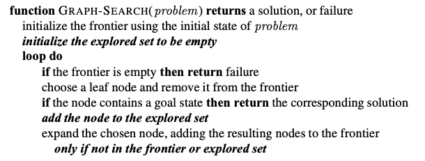

# Graph Search

---
Attempts to find the goal state from an initial problem state by traversing a search tree super imposed over the state space graph. Each transition is some action to traverse between states in the state space graph which coorespond to nodes in the search tree. The search tree may have many nodes that coorespond to one node in state space.

## Algorithm

## [[20240226-070949-depth-first-search|Depth-First Search]]

## [[20240226-074659-breadth-first-search|Breadth-First Search]]
<!-- markdownlint-disable-file MD013 -->
<!-- markdownlint-disable-file MD025 -->
