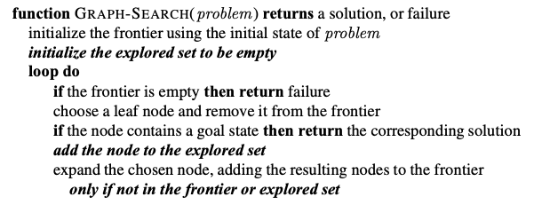

# Graph Search

---
Attempts to find the goal state from an initial problem state by traversing a search tree super imposed over the state space graph. Each transition is some action to traverse between states in the state space graph which correspond to nodes in the search tree. The search tree may have many nodes that correspond to one node in state space.

## Algorithm

## Uninformed Search Algorithms

- [ ] [[20240226-070949-depth-first-search#algorithm|Depth-First Search]]
- [ ] [[20240226-074659-breadth-first-search#algorithm|Breadth-First Search]]

## Category?

- [ ] Minimum Spanning Tree
- [ ] Single Source Shortest Path
- [ ] All Pairs Shortest Paths
- [ ] Maximum Flow

<!-- markdownlint-disable-file MD013 -->
<!-- markdownlint-disable-file MD025 -->
