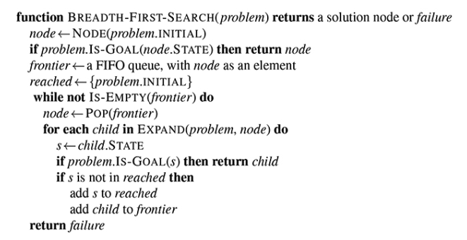

# Breadth-First Search

---
Description of BFS here...

## Algorithm



&nbsp;

# [PacMan Grid World](https://www.hackerrank.com/challenges/pacman-bfs?isFullScreen=true&hr_b=1)

---
Given a grid of dimension R x C, the locations of PacMan, the food, & the string based grid world; implement a function that performs BFS, printing out the number of nodes expanded on the first line followed by each node visited "R C" on each following line. Include the initial problem state. The expansion of a node should order its children UP, LEFT, RIGHT, DOWN where they exist.

## Explore

The instruction is explicit, we're implementing BFS. The following tree has nodes numbered by the order they would be explored by the BFS algorithm.

             ┌───┐             BFS runs on graphs other than trees. One
             │ 1 │             must keep track of which nodes have been 
             └─┬─┘             explored & avoid them.    E.g.
        ┌──────┼──────┐
        ▼      ▼      ▼                      ┌──────┐
      ┌───┐  ┌───┐  ┌───┐                    │      ▼
      │ 2 │  │ 3 │  │ 4 │                  ┌─┴─┐  ┌───┐  ┌───┐  
      └─┬─┘  └───┘  └─┬─┘                  │ 2 │◄─┤ 1 ├─►│ 3 │
        │          ┌──┴──┐                 └─┬─┘  └───┘  └───┘
        ▼          ▼     ▼                   ▼
      ┌───┐      ┌───┐ ┌───┐               ┌───┐  
      │ 5 │      │ 6 │ │ 7 │               │ 4 │
      └───┘      └─┬─┘ └───┘               └───┘
                   ▼                       
                 ┌───┐         In other search algorithms, the shortest 
                 │ 8 │         path discovered so far must be kept track
                 └───┘         of & compared against rediscoveries.     

## C++ Solution

```cpp
#include <iostream>
#include <vector>
#include <sstream>
#include <queue>
#include <unordered_map>
using namespace std;

struct Node {
  char data;
  pair<int, int> coordinates;
};

char OPEN = '-';
char WALL = '%';
char FOOD = '.';
char PACMAN = 'P';

vector<pair<int, int>> moves = {
  make_pair(-1, 0),
  make_pair(0, -1),
  make_pair(0, 1),
  make_pair(1, 0)
};

string get_coord_string(pair<int, int> coordinates) {
    return to_string(coordinates.first) + '_' + to_string(coordinates.second);
}

vector<Node> expand(Node node, vector<string> grid, int r, int c) {
  vector<Node> children;
  for (pair<int, int> move : moves) {
    int r_move = node.coordinates.first + move.first;
    int c_move = node.coordinates.second + move.second;
    if (0 <= r_move && r_move < r && 0 <= c_move && c_move < c && grid[r_move][c_move] != WALL) {
      struct Node child = { grid[r_move][c_move], make_pair(r_move, c_move) };
      children.push_back(child);
    }
  }
  return children;
}

void nextMove( int r, int c, int pacman_r, int pacman_c, int food_r, int food_c, vector <string> grid){
  if (grid[pacman_r][pacman_c] == FOOD) {
    cout << 1 << endl;
    cout << pacman_r << ' ' << pacman_c << endl;
    return;
  }
  
  stringstream ss;
  queue<Node> frontier;
  struct Node start = { PACMAN, make_pair(pacman_r, pacman_c) };
  frontier.push(start);
  unordered_map<string, Node> reached;
  reached[get_coord_string(start.coordinates)] = start;

  while (!frontier.empty()) {
    Node current = frontier.front();
    frontier.pop();
    for (Node child : expand(current, grid, r, c)) {
      if (reached.find(get_coord_string(child.coordinates)) != reached.end()) {
        ss << child.coordinates.first << ' ' << child.coordinates.second << endl;
        if ( child.data == FOOD ) {
          cout << reached.size() + 1 << endl;
          cout << ss.str();
        }
        reached[get_coord_string(child.coordinates)] = child;
        frontier.push(child);
      }
    }
  }
  return; //failed to find food
}
```

## Python Solution

```python
Def max_sum_path(root):
 Def mps(node, cmax):
  If not node:           # identify the base case
   Return 0

  L = max(0, mps(node.left))    # recurse left & right
  R = max(0, mps(node.right))   # special case: ignore negatives
  
  Cmax[‘value’] = max(cmax[‘value’], node.val+l+r)  
# special case: tracking the max
  Return node.val+max(l,r)      # combine the results

cmax = { ‘value’: float(‘-inf’) }
 mps(root, cmax)
 return cmax[‘value’]

```

---

<!-- markdownlint-disable-file MD013 -->
<!-- markdownlint-disable-file MD025 -->
<!-- markdownlint-disable-file MD046 -->
