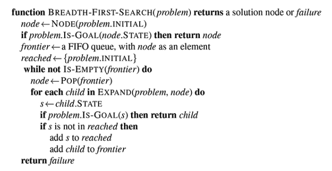

# Breadth-First Search

---
BFS is a graph search algorithm whose frontier is kept on a LIFO queue to ensure that the shallowest nodes are all explored first which comes with the guarantee that given enough time BFS always find the solution if it exists. As long as path cost is a non-decreasing function of search depth, then BFS will return an optimal solution. In any other case, there is no guarantee of optimality. Time & space complexity are a function of the size of the branching factor & depth of the search graph, i.e. O(b^d).

## Algorithm



- [ ] [[#PacMan Grid World]]

&nbsp;

# PacMan Grid World

---
Given a grid of dimension R x C, the locations of PacMan, the food, & the string based grid world; implement a function that performs BFS, printing out the number of nodes expanded on the first line followed by each node visited "R C" on each following line. Include the initial problem state. The expansion of a node should order its children UP, LEFT, RIGHT, DOWN where they exist.

```text
                            11 9
                            2 15
                            13 20
                            %%%%%%%%%%%%%%%%%%%%
                            %----%--------%----%
                            %-%%-%-%%--%%-%.%%-%
                            %-%-----%--%-----%-%
                            %-%-%%-%%--%%-%%-%-%
                            %-----------%-%----%
                            %-%----%%%%%%-%--%-%
                            %-%----%----%-%--%-%
                            %-%----%-%%%%-%--%-%
                            %-%-----------%--%-%
                            %-%%-%-%%%%%%-%-%%-%
                            %----%---P----%----%
                            %%%%%%%%%%%%%%%%%%%%

```

## Explore

The instruction is explicit, we're implementing BFS. The following tree has nodes numbered by the order they would be explored by the BFS algorithm.

                   ┌───┐             BFS runs on graphs other than trees. One
                   │ 1 │             must keep track of which nodes have been 
                   └─┬─┘             explored & avoid them.    E.g.
              ┌──────┼──────┐
              ▼      ▼      ▼                      ┌──────┐
            ┌───┐  ┌───┐  ┌───┐                    │      ▼
            │ 2 │  │ 3 │  │ 4 │                  ┌─┴─┐  ┌───┐  ┌───┐  
            └─┬─┘  └───┘  └─┬─┘                  │ 2 │◄─┤ 1 ├─►│ 3 │
              │          ┌──┴──┐                 └─┬─┘  └───┘  └───┘
              ▼          ▼     ▼                   ▼
            ┌───┐      ┌───┐ ┌───┐               ┌───┐  
            │ 5 │      │ 6 │ │ 7 │               │ 4 │
            └───┘      └─┬─┘ └───┘               └───┘
                         ▼                       
                      ┌───┐         In other search algorithms, the shortest 
                      │ 8 │         path discovered so far must be kept track
                      └───┘         of & compared against rediscoveries.     

## Python Solution

```python
import os
from dataclasses import dataclass
from collections import deque
from typing import Optional, List


MOVES = [(-1, 0), (0, -1), (0, 1), (1, 0)]
GOAL = "."
OBSTACLES = {"%"}


@dataclass(frozen=True, eq=True)
class Node:
    row: int
    col: int
    value: str


def is_goal(node) -> bool:
    return node.value == GOAL


def print_solution(visits):
    print(len(visits))
    for node in visits:
        print(f"{node.row} {node.col}")


def expand(node, grid):
    for i, j in MOVES:
        r = node.row + i
        c = node.col + j
        if 0 <= r < len(grid) and 0 <= c < len(grid[0]) and grid[r][c] not in OBSTACLES:
            yield Node(r, c, grid[r][c])


def next_move(nr, nc, pr, pc, fr, fc, grid):
    start = Node(pr, pc, grid[pr][pc])
    frontier = deque([start])
    explored = {start}
    visits = []

    while frontier:
        current = frontier.popleft()
        explored.add(child)
        visits.append(current)
        if is_goal(current):
            break

        for child in expand(current, grid):
            if child not in reached:
                frontier.append(child)

    print_solution(visits)
    return


def get_input():
    pr, pc = list(map(int, input().split()))
    fr, fc = list(map(int, input().split()))
    n, m = list(map(int, input().split()))

    grid = []
    for i in range(0, n):
        grid.append(list(map(str, input())))

    return n, m, pr, pc, fr, fc, grid


next_move(*get_input())
```

## Complexity Analysis

If each state has at most 3 successor states, then our time complexity of O(3^d) where d is the depth of search tree through the grid. For each node we store a constant amount of information yielding a space complexity of O(3^d). Here, three is known as the branching factor, which as you can imagine becomes quickly unwieldy as depth increases.

## C++ Solution

TODO: c++ solution

```cpp
#include <iostream>
#include <vector>
#include <sstream>
#include <queue>
#include <unordered_map>
using namespace std;

struct Node {
  char data;
  pair<int, int> coordinates;
};

char OPEN = '-';
char WALL = '%';
char FOOD = '.';
char PACMAN = 'P';

vector<pair<int, int>> moves = {
  make_pair(-1, 0),
  make_pair(0, -1),
  make_pair(0, 1),
  make_pair(1, 0)
};

string get_coord_string(pair<int, int> coordinates) {
    return to_string(coordinates.first) + '_' + to_string(coordinates.second);
}

vector<Node> expand(Node node, vector<string> grid, int r, int c) {
  vector<Node> children;
  for (pair<int, int> move : moves) {
    int r_move = node.coordinates.first + move.first;
    int c_move = node.coordinates.second + move.second;
    if (0 <= r_move && r_move < r && 0 <= c_move && c_move < c && grid[r_move][c_move] != WALL) {
      struct Node child = { grid[r_move][c_move], make_pair(r_move, c_move) };
      children.push_back(child);
    }
  }
  return children;
}

void nextMove( int r, int c, int pacman_r, int pacman_c, int food_r, int food_c, vector <string> grid){
  if (grid[pacman_r][pacman_c] == FOOD) {
    cout << 1 << endl;
    cout << pacman_r << ' ' << pacman_c << endl;
    return;
  }
  
  stringstream ss;
  queue<Node> frontier;
  struct Node start = { PACMAN, make_pair(pacman_r, pacman_c) };
  frontier.push(start);
  unordered_map<string, Node> reached;
  reached[get_coord_string(start.coordinates)] = start;

  while (!frontier.empty()) {
    Node current = frontier.front();
    frontier.pop();
    for (Node child : expand(current, grid, r, c)) {
      if (reached.find(get_coord_string(child.coordinates)) != reached.end()) {
        ss << child.coordinates.first << ' ' << child.coordinates.second << endl;
        if ( child.data == FOOD ) {
          cout << reached.size() + 1 << endl;
          cout << ss.str();
        }
        reached[get_coord_string(child.coordinates)] = child;
        frontier.push(child);
      }
    }
  }
  return; //failed to find food
}

int main(void) {

    int r,c, pacman_r, pacman_c, food_r, food_c;
    
    cin >> pacman_r >> pacman_c;
    cin >> food_r >> food_c;
    cin >> r >> c;
    vector <string> grid;

    for(int i=0; i<r; i++) {
        string s; cin >> s;
        grid.push_back(s);
    }

    nextMove( r, c, pacman_r, pacman_c, food_r, food_c, grid);

    return 0;
}

```

&nbsp;
