# Probability Thoery

---
There are two kinds of ==uncertainty==, ==intrinsic== uncertainty, aka ==noise== or ==stochastic== uncertainty, & ==epistemic== uncertainty, aka systematic uncertainty. ==Intrinsic uncertainty==, noise, is due to our observations of the world being limited to partial information which can be reduced by gathering different kinds of data. ==Epistemic uncertainty== comes from limitations on the amount of data we have to observe & can be reduced through more data. Even with infinity large data sets to get rid of epistemic uncertainty, we still fail to achieve perfect accuracy due to intrinsic uncertainty.

==Probability Theory== is a framework that provides tools for consistent quantification & manipulation of uncertainty. ==Decision Theory== allows us to make optimal predictions using this information even in the presence of uncertainty. The ==frequentist== view of statistics defines probability in terms of the frequency of repeatable events. There is another school of thinking about probability that is more general & includes the ==frequentist== perspective as a special case. The use of probability as the quantification of uncertainty is called the ==Bayesian== perspective. It allows us to reason about events that are not repeatable & therefore out of the scope of the ==frequentist== view.  

## The Rules of Probability

Two simple formulas govern probabilities, the ==sum rule== & the ==product rule==.
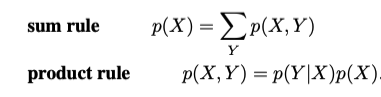

These rules use variables to represent the possibilities of events that are unknown which are therefore called ==random variables==. The following example shows the different kinds of probabilities: ==joint, conditional, & marginal probabilities==.
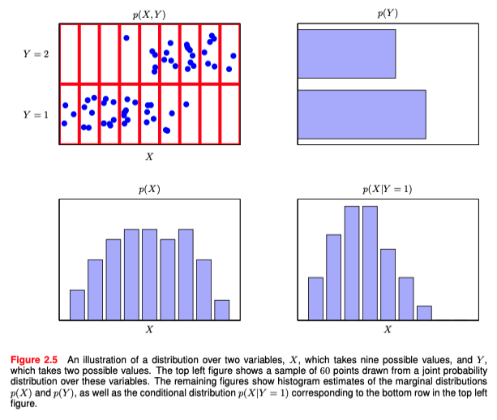

A ==Joint probability== is the probability of two things happening together, i.e. the probability of x & y which is written like the left hand side of the product rule. A ==conditional probability== is the probability that one event will happen given another event has happened, i.e. the probability of x given y which appears in the product rule & in ==Bayes' Theorem==.

## Bayes' Theorem

By the product rule & symmetry we arrive at ==Bayes' Theorem== which is an important theorem that relates a conditional probability to its reversed conditional probability.
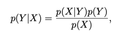

The denominator in ==Bayes' Theorem== can be thought of as a normalization constant there to ensure that the sum over Y will result in a probability of one.
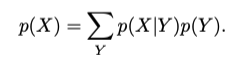

There is an additional interpretation of probabilities from ==Bayes Theorem== as the information before an event occurs & the information after. These are referred to as the ==prior probability== & the ==posterior probability==, i.e. p(X) & p(Y|X).

## Independent Variables

If the joint distribution can be factored into the product of marginal probabilities, then the variables in the joint distribution are called ==independent==. The occurrence of one will give us no information about the probability of the other.

## Probability Densities

Probabilities also apply to continuous variables which are known as ==continuous random variables==. We quantify the uncertainty in some prediction by saying, the probability of x falling in to some interval x+dx is equal to the ==probability density==.
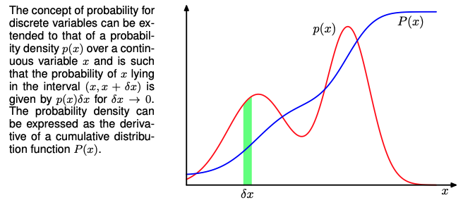

The rules of probability still govern but take on slightly different forms. The second image is the continuous version of Bayes' Theorem.
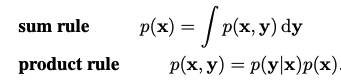
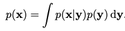

A few examples of probability density distributions are shows below with their corresponding density functions.
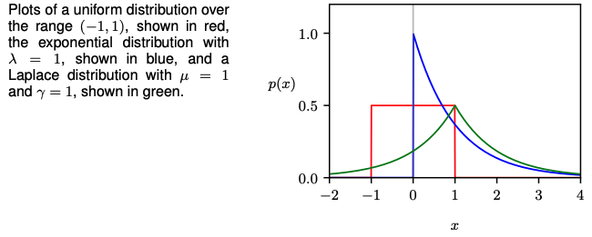
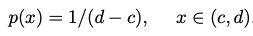
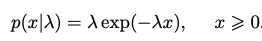
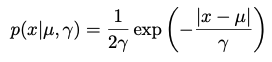

The empirical distribution uses the Dirac delta function to assign all density to a data set, i.e. it integrates to 1. This is accomplished by conditioning many Dirac delta functions on a set of data observations.
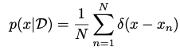

## Expectation & Covariance

Often, we want to find the weighted average of some function under a probability distribution, i.e. the ==expectation== of a function. The idea applies to discrete & continuous random variables.
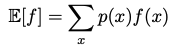
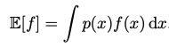

In both cases, given N points from a distribution, we can approximate the ==expectation== by summing over the points & normalizing.
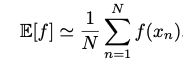

The same idea works with functions of multiple variables & conditional distributions & is denoted by a subscript variable or a conditional bar in the expectation. ==Variance== is a measure of how much a random variable varies around its mean value, i.e. ==expectation==. Variance may also be written in terms of expectations of a function & its square.
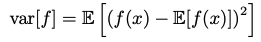
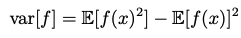

==Covariance== measures the extent to which two variables move together. A value of zero implies that the variables are independent. In the vector case, covariance is given by a matrix.
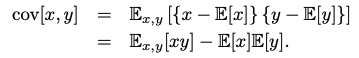

## Bayesian Probabilities

## [[20240327-144855-standard-probability-distributions|Standard Probability Distributions]]

<!-- markdownlint-disable-file MD013 -->
<!-- markdownlint-disable-file MD025 -->
