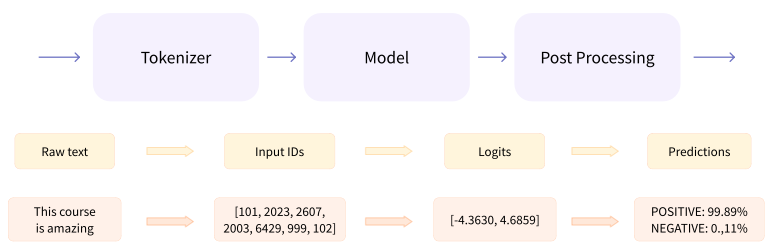
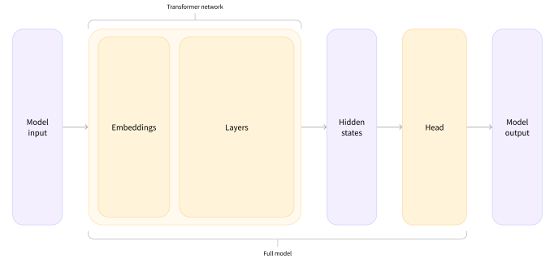
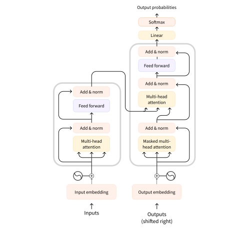

# Transformers

---
Transformers are ==language models==, i.e. they are trained on large amounts of raw text in a [[20240121-deep-learning#self-supervised-learning|self-supervised]] fashion. The transformer [[#Architectures|architecture]] was invented in June 2017 & within a year, [[#Auto-Regressive Transformers|GPT]] became the first pretrained transformer that obtained state-of-the-art results with ==fine-tuning== across various [[20240409-091207-natural-language-processing#tasks|NLP Tasks]].

```table-of-contents
minLevel:2
```

Transformers are primarily composed of two blocks, the [[#Encoder]] & the [[#Decoder]]. The ==encoder== is designed to build a representation of its input & the ==decoder== is designed to use the encoder's representations along with other inputs to generate a ==target sequence== which is based on the probabilities it generates. Each of the independent parts can be used separately for different tasks that need either an encoder or decoder.

An important feature of the transformer model is the concept of ==attention==. In the ==translation== task, e.g., the translation of "You like Blaise" from English to French, the verb "like" has a translation dependent on "You". If this French language concept is important, models need a way to express that relationship. The mechanism for this expression in transformers is the [[#Attention Layer]]. The general idea is that words in context have more meaning than they do in isolation. The context in either direction can be important in understanding a token.

The actual implementation of a transformer is more complicated than just an encoder & decoder. There is a ==tokenizer== & ==post processing== as well. Neural networks can't process raw text directly, instead we use tokenizers to convert raw text to tokens, add useful tokens like \<start\>, & then map tokens to integers. This ==tokenization== process must match the pre-trained model exactly.


The output of a transformer with no specific ==model head== is a vector of ==hidden states== or ==latent variables==. These represent the model's contextual understanding of the input. These can be useful on their own, but frequently they are inputs to ==model heads==.

==Embeddings== are vectorizations of tokens which are transformed through attention layers into sentence level ==hidden states==. These hidden states are inputs to a model head which produces model output. E.g., if we want to do sentiment analysis, then our output would be n x 2 for the n inputs with positive or negative ==logit== scores, unnormalized model outputs, which can be used to predict the output classification via a ==SoftMax== layer which outputs normalized probabilities.

&nbsp;

## Building Blocks

---
There are a few key concepts that compose ==transformers==, encoders, decoders, & attention layers.

### Encoder

Encoders take in sequences of tokens & embedded them into a multidimensional vector space, outputting a corresponding sequence of vectors or tensors. Usually, attention layers have access to all the tokens in a senctence, i.e. they have ==bi-directional attention==. This type of encoder is often called an auto-encoding model. Pre-training an encoder often involves masking the original input sentence & tasking the model with reconstructing the input. Some examples from the family of encoder models are listed here.

- [ ] [ALBERT](https://huggingface.co/docs/transformers/model_doc/albert)
- [ ] [BERT](https://huggingface.co/docs/transformers/model_doc/bert)
- [ ] [DistilBERT](https://huggingface.co/docs/transformers/model_doc/distilbert)
- [ ] [ELECTRA](https://huggingface.co/docs/transformers/model_doc/electra)
- [ ] [RoBERTa](https://huggingface.co/docs/transformers/model_doc/roberta)

Encoders are great at ==masked language modeling== because of their bi-directional encoding. They are also useful for ==sequence classification==, e.g. ==sentiment analysis==.

### Decoder

Decoders are almost identical to encoders, taking token sequences as input & outputting vector sequences just as before. The difference is that decoders only allow themselves to see previous or future tokens while calculating token embeddings which is referred to as ==masked self-attention==. ==Masked self-attention== only takes in the context from one direction or the other, tokens to the left of the current token or to the right of it, a.k.a. ==unidirectional attention==. ==Auto-Regressive decoders== only have access to words that appear before the current token in a sentence, i.e. they feed their previous outputs into themselves to generate more output. The length of the output that a model can generate without losing memory of the first generated token is known as its ==maximum context==. Pre-training decoders centers around predicting the next word in a sentence. A few examples of decoder models are listed here.

- [ ] [CTRL](https://huggingface.co/transformers/model_doc/ctrl)
- [ ] [GPT](https://huggingface.co/docs/transformers/model_doc/openai-gpt)
- [ ] [GPT-2](https://huggingface.co/transformers/model_doc/gpt2)
- [ ] [Transformer XL](https://huggingface.co/transformers/model_doc/transfo-xl)

Decoders are good at ==causal tasks==, e.g. sequence generation tasks like ==causal language modeling== a.k.a. ==natural language generation==.

### Encoder-Decoder | Sequence-to-Sequence

In ==encoder-decoder== models, the decoder takes in a masked sequence just as before, but it also takes in vector sequence output from the encoder. So, e.g., the encoder may encode an English sentence & pass it as input to the decoder which could also take in a start token, e.g. \<start\>. This would prompt the decoder to begin generating output. If it was trained to translate from English to Japanese, it would start generating Japanese tokens until it generated a sentence end token, e.g. \<end\>. This architecture allows the input sequence length to be different from the output sequence length. Pre-training ==sequence-to-sequence== models is often more complicated than using the respective objectives of each architecture. The following are examples of sequence-to-sequence models.

- [ ] [BART](https://huggingface.co/transformers/model_doc/bart)
- [ ] [mBART](https://huggingface.co/transformers/model_doc/mbart)
- [ ] [Marian](https://huggingface.co/transformers/model_doc/marian)
- [ ] [T5](https://huggingface.co/transformers/model_doc/t5)

### Attention Layer

The original transformer paper was called [Attention Is All You Need](https://arxiv.org/abs/1706.03762).

&nbsp;

## Architectures

---
There are a few categories of transformers that have emerged over the years & which are listed below, but first, the original transformer architecture from the attention paper, is as follows.


- [ ] [[#Auto-Regressive Transformers]]
- [ ] [[#Auto-Encoding Transformers]]
- [ ] [[#Sequence-to-Sequence Transformers]]

&nbsp;

### Auto-Regressive Transformers

GPT-like models are known as ==auto-regressive== transformers.

&nbsp;

### Auto-Encoding Transformers

BERT-like models are known as ==auto-encoding== transformers.

&nbsp;

### Sequence-to-Sequence Transformers

BART|T5-like models are known as ==sequence-to-sequence== transformers.

&nbsp;

## Libraries

---

- [ ] [HuggingFace Transformers](https://huggingface.co/docs/transformers/index)

&nbsp;

## Examples

---

- [ ] [[20240524-105915-transformers-from-scratch#transformers-from-scratch|Transformers From Scratch]]
