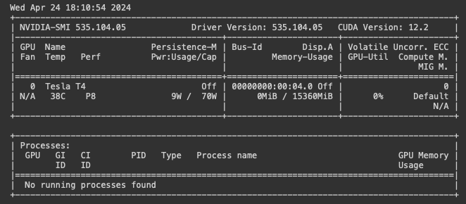
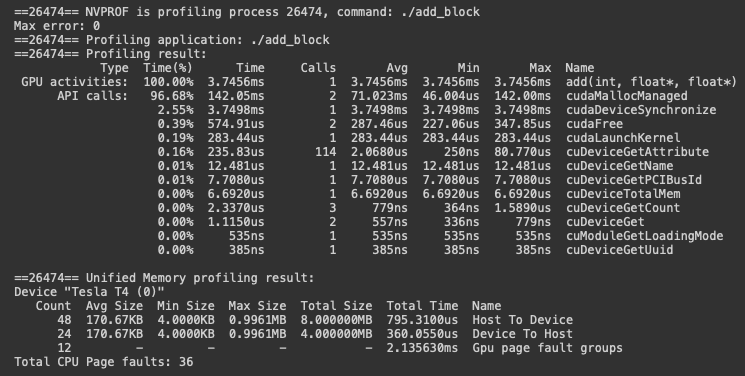
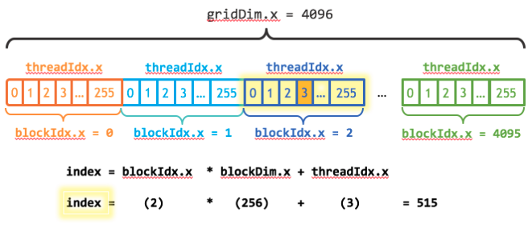
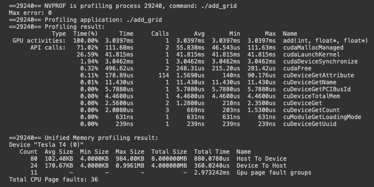

# GPU Programming

---
Is to write software which runs on [[20240428-153027-gpu-architecture#gpu-architecture|Graphics Processing Units]]. ==GPGPU== is general purpose computing on ==GPUs== which were only originally intended for graphics computations. These devices are designed to have thousands of cores which makes them very good at ==parallel processing==. [[20240426-143105-parallel-algorithms#parallel-algorithms|Parallel Algorithms]] are designed to get the most benefit from parallel machines, but host devices need a way to run the relevant sections of programs on the right device. The most prominent way to do this is through the ==CUDA==, ==Compute Unified Device Archecture==, programming model. There are other paradigms & interfaces becoming increasingly import, e.g. ==HIP== which runs code on AMD devices. There are a few basic elements needed to get code running on an Nvidia GPU outlined below.

```table-of-contents
minLevel:2
```

&nbsp;

## Host & Device Memory Allocation

---
Nvidia GPUs have their own memory, ==global memory== which is DRAM based & block level ==shared memory==. Allocating memory to a device, launching the kernel, & then copying the solution from the device to the CPU works like this.

```cpp
const int N = 4096;
const int BLOCK_SIZE = 256;

float *a, *b, *c, *d_a, *d_b, *d_c;
a = new float[N];
b = new float[N];
c = new float[N];

for (int i = 0; i < N; i++) {
  a[i] = rand() / (float)RAND_MAX;
  b[i] = rand() / (float)RAND_MAX;
  c[i] = 0;
}

cudaMalloc(&d_a, N * sizeof(float));
cudaMalloc(&d_b, N * sizeof(float));
cudaMalloc(&d_c, N * sizeof(float));

cudaMemcpy(d_a, a, N * sizeof(float), cudaMemcpyHostToDevice);
cudaMemcpy(d_b, b, N * sizeof(float), cudaMemcpyHostToDevice);
cudaMemcpy(d_c, c, N * sizeof(float), cudaMemcpyHostToDevice);

vectorAddition<<<nBlocks, nThreads>>>(d_a, d_b, d_c, N);

cudaMemcpy(c, d_c, N * sizeof(float), cudaMemcpyDeviceToHost);
```

## Unified Memory

---
There is a newer memory concept now ubiquitous in CUDA programming known as ==unified memory==. Unified Memory is a single memory space accessible by all CPUs & GPUs in a system. Allocating & freeing unified memory is as follows.

```cpp
float* x;
cudaMallocManaged(&x, N * sizeof(float));
cudaFree(x);
```

### What is the goal of unified memory?

CUDA always involves the 3-step process:

1. Copy input from CPU to GPU memory.
2. Load GPU program & execute.
3. Copy output from GPU to CPU memory.

The idea of unified memory is to get rid of steps \#1 & \#3. ==Unified memory== was added ~2012 with the ==Kepler GPU architecture== & ==CUDA 6==. It moves us from having two pointers, one for host & one for device memory, to having one pointer to the unified memory. The ==CUDA runtime== takes care of steps \#1 & \#3 underneath. This accomplishes a few things:

1. Single allocation, single pointer, accessible anywhere.
2. Eliminate boilerplate explicit copying.
3. Simplifies code porting.
4. Migrates data to accessing processor.
5. Guarantees global coherence.

==CUDA 8== & the ==Pascal architecture== represented a big leap forward for ==unified memory==. It unlocked ==over subscription== to GPU memory through ==demand paging== & ==unified memory atomics== for CPU/GPU data coherence.

### What actually happens underneath?

1. cudaMallocManaged reserves memory (managed memory is the same thing as unified memory).
2. memset() causes page faults as it traverses the reserved memory which is still unallocated. The host system handles the page faults by providing memory pages which are then populated by memset().
3. The kernel launches & tries to write to device memory which causes a pagefault which is facilitated by the device system by migrating over the memory from the host. The same idea works in the opposite direction as well.

Windows machines & pre-pascal architectures do not have demand paging & therefore copy all memory over on kernel launch even if that part of memory is never touched by the device. The implications of this are that you must call ==cudaDeviceSynchronize()== in these situations to let the runtime know to make the data available to the host again. Moreover, there is no concurrent access or over subscription in these situations.

### What are system-wide atomics?

Any system, i.e. any number of hosts & devices, can by synchronized using ==system-wide atomics== on PASCAL+ architectures. ==Unified memory== still works the same way in multi-device systems but you might wish to modify the same memory allocated with ==cudaMallocManaged()== on many hosts & devices at the same time. This is possible but there are no ordering or visibility guarantees, therefore, CUDA offers ==system-wide atomics==.

### How does over subscription work?

It is possible to run kernels without enough GPU memory to fit all of the host data through over subscription. ==Over subscription== became possible with ==unified memory== on ==PASCAL+== architectures. When kernel code touches an allocation for which the memory page has not migrated, it is then migrated onto the device. If device memory is at capacity, then the least recent accessed pages are migrated off of the device & then back on again when they are needed. It is possible that this process could lead to ==thrashing==. Over subscription does introduce overhead in the form of latency which is what the GPU is great at hiding.

### How does unified memory affect things in practice?

One example of an incredible benefit of ==unified memory== is that it knows how to do deep copies of data, so, as we see below, without ==unified memory==, given an array of structs that contain nested pointers, we'd need to go through many steps in order to migrate them to the device & back again. With managed memory, we need do no extra work. The same thing would be true if we were using a linked list, but this does not include C++ objects.

```cpp
struct dataElem {
  int key;
  int len;
  char* name;
};

void launch(dataElem* elem, int N) {
  // Allocate storage for array of struct and copy array to device
  dataElem* d_elem;
  cudamalloc(&d_elem, N * sizeof(dataElem));
  cudaMemcpy(d_elem, elem, N * sizeof(dataElem), cudaMemcpyHostToDevice);

  // allocate/fixup each buffer separately
  for (int i = 0; i < N; i++) {
    char* d_name;
    cudamalloc(&d_name, elem[i].len);
    cudaMemcpy(d_name, elemL1 - name, elemil - len, cudaMempyHostToDevice);
    cudaMemcpy(&(d_elem[1] - name), &d_name, sizeof(char*),
               cudaMemcpyHostToDevice);
  }

  // Finally we can launch our kernel
  kernel<<<...>>>(d_elem);
}
```

### What about objects?

We can override the ==new & delete operators== in order to make C++ object memory allocation look & feel like it normally does.

```cpp
class Managed {
 public:
  void* operator new(size_t len) {
    void* ptr;
    cudaMallocManaged(&ptr, len);
    cudaDeviceSynchronize();
    return ptr;
  }

  void operator delete(void* ptr) {
    cudaDeviceSynchronize();
    cudaFree(ptr);
  }
};

// Deriving allows pass-by-reference
class umstring : public Managed {
  int length;
  char* data;

 public:
  // UM copy constructor allows pass-by-value
  umString(const umstring& s) {
    length = s.length;
    cudaMallocManaged(&data, length);
    memcpy(data, s.data, length);
  }
};

class dataElem : public Managed {
 public:
  int key;
  umString name;
};

// C++ now handles our deep copies
dataElem* data = new dataElem[N];
Kernel<<<...>>>(data);
```

### How can we avoid the overhead of demand paging?

Sometimes, ==demand paging== can slow things down, so CUDA gives us a tool called ==prefetching== in which we tell the runtime to explicitly copy the data to some device|host.

```cpp
// unified memory allocation
int n = 256 * 256;
int ds = n * sizeof(float);
float* data;
cudaMallocManaged(&data, ds);

// data to GPU# 0
cudaMemPrefetchAsync(data, ds, 0);
Kernel<<<256, 256>>>(data);
// data to host
cudaMemPrefetchAsync(data, ds, cudaCpuDeviceId);
```

We can also give the CUDA (unified memory) runtime hints about how we expect our data to accessed.

```cpp
// cudaMemAdviseSetReadMostly: specify read duplication
// cudaMemAdviseSetPreferredLocation: suggest best location (device#|host#) - serves data requests over inter processor bus (nvlink|pci-e|etc)
// cudaMemAdviseSetAccessedBy : suggest mapping to avoid pagefaults, i.e. access this data here instead of pagefaulting & migrating the data.
cudaMemAdvise(ptr, count, hint, device);
```

==Volta+ architectures== add access counters to help devices make good decisions about how to manage memory.

## Kernels

---
==CUDA kernels== make use of [[20240428-153027-gpu-architecture#gpu-architecture|GPU architectural]] features to accelerate computations. In order to run code on an Nvidia GPU, we need to let the ==CUDA compiler== know our intentions. That is accomplished through the use of a function specifier, ==\__global\__==. Take this vector addition function for example.

```cpp
__global__ void add(int N, float* x, float* y) {
  for (int i = 0; i < N; i++) {
    y[i] = x[i] + y[i];
  }
}
```

Launching a ==CUDA kernel== requires adding a triple angle bracket before the kernel function parameter list. These kernels do not block the calling thread & therefore, we must wait on CPU thread for the kernel to finish executing (in simple cases).

```cpp
add<<<1, 1>>>(N, x, y);
cudaDeviceSynchronize();
```

Now, the way that we invoked this, we only provided one GPU thread. That won't give us any speedup & given many threads, we'd just process the function over an over again, writing to same memory across many threads which would lead to race conditions. Imagine we have a little program that passes pointers to vectors to the add kernel above, let's compile it with ==nvcc== & see what happens on the GPU using ==nvprof== from the ==CUDA Toolkit==.

```bash
nvcc add.cu -o add_cuda
nvprof ./add_cuda
```


We might want to know what device we're using to run kernels & there is a little command line tool just for that.

```bash
nvidia-smi
```



## Parallel Threads

---
What if we want to have many threads work on this function? We have to modify the function to coordinate which parts of the vector different threads will work on. CUDA gives us two keywords that help us access the indices or running threads. The index of the current thread within its block, ==threadIdx.x==, & the number of threads in the block, ==blockDim.x==. We can use these to have each invocation only process the ith row of each block if we think of the input as divided into blocks to match the thread blocks.

==How many threads should be used?== CUDA GPUs run kernels with thread blocks that have sizes which are multiples of 32. Below we specify the use of 256 threads per block.

```cpp
__global__ void add(int n, float* x, float* y) {
  int index = threadIdx.x;
  int stride = blockDim.x;
  for (int i = index; i < n; i += stride)
    y[i] = x[i] + y[i];
}

add<<<1, 256>>>(N, x, y);
```

This updated function will process every index in the vector until all threads return. Each thread will eventually reach a condition that exits the for loop which will ensure that no i>=n will be processed.


## Parallel Processors

---
==CUDA GPUs== have many parallel processors which are grouped into ==Streaming Multiprocessors== each of which can run multiple concurrent thread blocks. The ==P100 GPU== based on the [Pascal Architecture](https://developer.nvidia.com/blog/inside-pascal/) has 56 ==SMs== which each support 2048 threads. ==How does CUDA allow us to utilize all of these threads?== By allowing us to specify the use of multiple thread blocks.

In CUDA programming, blocks of parallel threads are collectively known as ==the grid==. If we have N threads available, we just need to figure out how many blocks are needed to get >=N threads.

```cpp
// We add blocksize-1 to ensure the integer division rounds up.
// The -1 handles case: N % blocksize == 0 which would otherwise use an extra block.
const int BLOCK_SIZE = 256;
int numBlocks = (N + BLOCK_SIZE - 1) / BLOCK_SIZE;
int gridSize = numBlocks;
```



Then, we have to account for the ==grid== dimension, i.e. the number of blocks in a grid, which CUDA provides as ==gridDim.x== & for the block index which is called ==blockIdx.x==. Mark Harris (Nvidia) refers to the code `blockIdx.x * blockDim.x + threadIdx.x` as idiomatic to CUDA. This type of CUDA loop is known as a [grid-stride loop](https://developer.nvidia.com/blog/cuda-pro-tip-write-flexible-kernels-grid-stride-loops/)==.

```cpp
__global__ void add(int n, float* x, float* y) {
  int index = blockIdx.x * blockDim.x + threadIdx.x;
  int stride = blockDim.x * gridDim.x;
  for (int i = index; i < n; i += stride)
    y[i] = x[i] + y[i];
}

add<<<numBlocks, blockSize>>>(N, x, y);
```



## Error Checking

---
The CUDA library in particular does not throw exceptions but instead returns status codes that prompt the user to check for error descriptions. Here is a generic macro which accomplishes that.

```cpp
#define cudaCheckErrors(msg)                                  \
  do {                                                        \
    cudaError_t __err = cudaGetLastError();                   \
    if (__err != cudaSuccess) {                               \
      fprintf(stderr, "Fatal error: %s (%s at %s:%d)\n", msg, \
              cudaGetErrorString(__err), __FILE__, __LINE__); \
      fprintf(stderr, "*** FAILED - ABORTING\n");             \
      exit(1);                                                \
    }                                                         \
  } while (0)

cudaCheckErrors("Allocating memory on device failed.");
```

Why use a macro? Macros have access to line# & file information & they are faster because they inline wherever they are used. There are newer ways to get the same information that get away from macros which can be quirky, but this was the Nvidia preference in the [OakRidge CUDA Training Course](https://www.olcf.ornl.gov/cuda-training-series) materials. This was likely heavily influenced by veteran C-programmers.

CUDA library invocations all return ==cudaError_t==, an error|success enumeration, which should be used to check for success & handle errors every time to ensure rigorous programs. ==Kernel launch syntax== is not using the CUDA runtime API & does not return anything. CUDA runtime errors, kernel code errors, are often not reported until the next CUDA API call due to ==asynchronous kernel launches==. This can be very confusing. Asynchronous errors are ==sticky errors== that corrupt the CUDA context & will be persistently returned from every subsequent CUDA API call. Synchronous errors are ==non sticky== & subsequent calls to the API will not return the error. Synchronous errors are discoverable at kernel launch time.

## Debugging

---
Often, it makes sense to add debug mode only statements that call ==cudaDeviceSynchronize()== just after kernel invocations. This can also be done using an environment variable that turns all kernel invocations into synchronous calls.

==Compute-Sanitizer== is a functional correctness checking tool. It runs applications & checks their correctness. Compute-Sanitizer works with CUDA Fortran & Python as well. It contains ==memcheck== which can give you detailed errors about memory issues. ==RaceCheck== detects shared memory race conditions or hazards: ==RAW==, ==WAW==, ==WAR==. The ==initcheck== tool finds global memory accesses of data that haven't been initialized. ==SyncCheck== detects illegal usage of synchronization primitives. Usage of these tools is as follows.

```bash
# Detects Kernel execution errors like:
#   Invalid/out-of-bounds memory access
#   Invalid PC/Invalid instruction
#   Misaligned address for data load/store
#
# Provides error localization when the executable is compiled with -lineinfo.
# Device side memory allocation leak checking.
# Slows down the program 10x, best with unit tests.
compute-sanitizer ./executable  # default tool
compute-sanitizer --tool memcheck ./executable

# Finds shared-memory race conditions (only shared-memory).
#   WAW – two writes to the same location that don’t have intervening synchronization
#   RAW – a write, followed by a read to a particular location, without intervening synchronization
#   WAR – a read, followed by a write, without intervening synchronization
compute-sanitizer --tool racecheck ./executable

# Detects use of uninitialized device global memory.
compute-sanitizer --tool initcheck ./executable

# Used to check for threads that could never reach a sync point, but that has been relaxed in recent architectures.
compute-sanitizer --tool synccheck ./executable
```

The tool that is used to actually debug code is the ==CUDA-GDB== debugger. The best time to use the debugger is when the answer you're getting is wrong. It's probably better to address errors with the other tools first & it's a good idea to run the profiler to ensure that the CUDA kernels are actually launching.

```bash
# check CUDA Kernel Statistics to ensure kernels are actually launching
nsys profile --stats=true ./my_executable 

# -g builds debug host code
# -G builds debug device code
# be sure to specify the target architecture, e.g. -arch=sm_70
nvcc -g -G -arch=sm_70 
```

==CUDA-GDB== shares almost exactly the same API as GDB with the addition of CUDA specific commands like the following.

```bash
# Set general & advanced settings:
#   launch_blocking - cause the host thread to block on launch
#   break_on_launch - break on every new kernel launch
set cuda {setting}

# Get information on system configuration.
#   devices, sms, warps, lanes, kernels, blocks, threads
info cuda {concept}

# Inspect or set the current thread focus because we're dealing with massive #s of parallel threads.
cuda device sm warp lane block thread
  # block (0,0,0), thread (0,0,0), device 0, sm 0, warp 0, lane 0
cuda thread (15) <change coordinate(s)>
```
