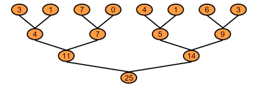
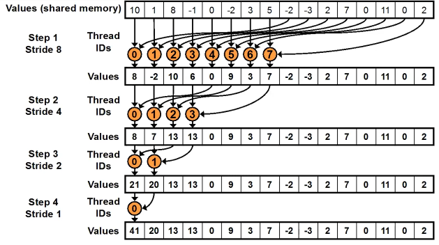
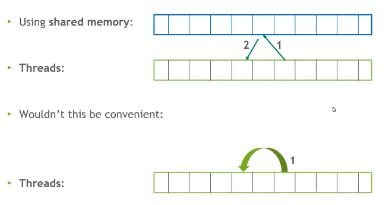

# Parallel Algorithms

---
==Sequential algorithms== specify a sequence of steps that each perform one operation, but ==Parallel algorithms== perform multiple operations per step. There are two core types of problems that are solved by parallel algorithms, ==transformations== & ==reductions==. Generally, the approach to ==transformation problems== is to assign one thread per output due to the fact that these problems generally have input size equal to output size. ==Reduction problems== are fundamentally different & generally more difficult to solve because they reduce the size of the input to produce the output.

```table-of-contents
```

&nbsp;

## Atomics

==Reduction== problems run into the scenario in which many threads need to modify the same memory but this cannot happen successfully at the same time. ==Nvidia GPUs== have many instructions that facilitate atomic operations. These instructions are limited to int, unsigned, float, etc... data types. Atomic operations happen by a special mechanism in the ==L2 cache==. ==Atomic operations== return the old value before the atomic update & are ==RMW== operations.

1. atomicMax/Min
2. atomicAdd/Sub
3. atomicInc/Dec
4. atomicExch/CAS - swap values & conditional swap
5. atomicAnd/Or/Xor

<!--TODO: Where does this go? Where does the link into kernel optimizations go? Does kernel optimizations not need its own page?-->
There are many possible [[20240428-161112-kernel-optimizations|Kernel Optimizations]].

&nbsp;

# Parallel Reductions

---
The most basic approach for ==parallel redutions== is a tree-based method. The way to accomplish this is through ==global sychronization==, i.e. synchronization across the entire grid. One way to achieve this is to take advantage of ==CUDAs== default behavior on ==kernel launch== which is to synchronize globally. Other methods are ==threadblock level reduction==, ==threadblock draining==, & ==cooperative groups== which provide a set of primitives for thread cooperation & decomposition. If our goal is to sum the values in an array, we can represent that operation in a tree.



## Parallel Sweep Reduction

Looking at the tree, we can come up with a very simple method for the sub problems that fit within a thread block known as a ==parallel sweep reduction== for which an algorithm is given with a thread diagram. ==Sequential addressing== is achieved here by the threads which means this algorithm is ==bank conflict== free. ==Sequential addressing== occurs when threads read & write from shared memory at each index one thread next to the other which means that warps & blocks can share retrieved sectors.

```cpp
for (unsigned int s = blockDim.x / 2; s > 0; s >>= 1) {
  if (tid < s) {
    sdata[tid] += sdata[tid + s];
  }
  _syncthreads();
}
```



## Grid Stride Loops

==Sequential addressing== gets us thread block level sums, but we'd like to be able to scale ==sequential addressing== to some arbitrarily large dataset efficiently while maintaining ==coalesced loads & stores== & efficient shared memory usage. The way to generalize to arbitrarily large data is through the use of a ==grid stride loop== which assigns threads to the same memory locations over the entire global data array.

```cpp
int idx = threadIdx.x + blockDim.x * blockIdx.x;
while (idx < N) {
  sdata[tid] += gdata[idx];       // tid == threadIdx.x
  idx += gridDim.x * blockDim.x;  // grid width (threads/grid)
}
```

## Reduce

```cpp
__global__ void reduce(float* gdata, float* out) {
  __shared__ float sdata[BLOCK_SIZE];
  int tid = threadIdx.x;
  sdata[tid] = 0.0f;
  size_t idx = threadIdx.x + blockDim.x * blockIdx.x;

  // grid stride loop to sum each threadIdx over all grids into shared memory
  while (idx < N) {
    sdata[tid] += gdata[idx];
    idx += gridDim.x * blockDim.x;  // grid width (threads/grid)
  }

  // parallel sweep reduction to sum all threadIdx across grids into one array of block sums
  // i.e. this only sums the blockIdx block in all grid strides
  for (unsigned int s = blockDim.x / 2; s > 0; s >>= 1) {
    __syncthreads();
    if (tid < s)
      sdata[tid] += sdata[tid + s];
  }

  //---------------------------------------------------------------
  // The result of the reduction is written by the first thread
  // for each block of threads ... Some host program or other kernel
  // would need to perform another reduction on the output
  // or some other method that uses atomic operations is required.
  // The result of that reduction would be the sum of block sum,
  // the block sums having included every blockIdx in all grid strides.
  // if (tid == 0)
  //   out[blockIdx.x] = sdata[0];
  //---------------------------------------------------------------

  // Instead, we perform an atomicAdd across thread blocks to avoid more kernel invocations.
  // Here, sdata[0] is block level & holds the block sum across all grid strides.
  // Since we have reduced the input all the way down to the NBLOCKS|GRID_SIZE, we only need
  // that many atomic operations.
  if (tid == 0)
    atomicAdd(out, sdata[0]);
}
```

## Block Level Striding Row Sums

```cpp
const size_t DSIZE = 16384;  // matrix side dimension
const int BLOCK_SIZE = 256;  // CUDA maximum is 1024
// matrix row-sum kernel
__global__ void row_sums(const float* A, float* sums, size_t ds) {
  int idx = blockIdx.x;
  if (idx < ds) {
    __shared__ float smem[BLOCK_SIZE];
    int tid = threadIdx.x;
    smem[tid] = 0.0f;
    int blockOffset = tid;

    // block stride loop
    while (blockOffset < ds) {
      // idx * ds -> iterates rows
      // + blockOffset -> strides block length in each row
      smem[tid] += A[idx * ds + blockOffset];
      blockOffset += blockDim.x;
    }

    for (unsigned int p = blockDim.x >> 1; p > 0; p >>= 1) {
      __syncthreads();
      if (tid < p)
        smem[tid] += smem[tid + p];
    }

    // idx == #rows
    if (tid == 0)
      sums[idx] = smem[0];
  }
}
```

## Max Finding Reduction

```cpp
const size_t N = 8ULL * 1024ULL * 1024ULL;  // unsigned long long
const int BLOCK_SIZE = 256;                 // CUDA maximum is 1024

__global__ void reduce(float* gdata, float* out, size_t n) {
  __shared__ float sdata[BLOCK_SIZE];
  int tid = threadIdx.x;
  sdata[tid] = 0.0f;
  size_t idx = threadIdx.x + blockDim.x * blockIdx.x;

  // Grid Stride
  while (idx < n) {
    // CUDA does not allow std fns but does have a non atomic MAX|MIN
    sdata[tid] = max(sdata[tid], gdata[idx]);
    idx += gridDim.x * blockDim.x;
  }

  // parallel sweep reduction
  for (unsigned int s = blockDim.x / 2; s > 0; s >>= 1) {
    __syncthreads();
    if (tid < s)
      sdata[tid] = max(sdata[tid], sdata[tid + s]);
  }

  // given a multiple block input, output needs to be passed back into the
  // reduce kernel again to be reduced all the way to 1 float
  if (tid == 0)
    out[blockIdx.x] = sdata[0];
}
```

## Warp Shuffle

==Parallel reductions== use shared memory for intra thread communication. This means that each thread has to read & write from shared memory, but what if threads could communicate directly?


It turns out there is a mechanism for this called the ==Warp Shuffle== in which threads in a warp can communicate directly with each other. There are a few intrinsic operations that exist to facilitate the ==warp shuffle==.

```txt
        1. __shfl_sync(): copy from lane ID
        2. __shfl_xor_sync(): copy from calculated lane ID
        3. __shf_up_sync(): copy from delta/offset lower lane
        4. __shfl_down_sync(): copy from delta/offset higher lane
```

Source & destination threads need to participate, there is a mask parameter used in these operations that selects which warp lanes will participate. ==Warp shuffle== can reduce or eliminate shared memory usage which can be an occupancy bottleneck, it can reduce the number of instructions used, & reduce the level of explicit synchronization. There are other tools available, e.g. a value can be broadcast to all threads in a warp via a single instruction, warp level prefix sums & sorting are possible, & ==atomic aggregation== is possible, i.e. instead of 32 atomic operations, we can aggregate across a warp & then have one thread perform the atomic operation as shown below.

```cpp
__global__ void reduce_ws(float* gdata, float* out) {
  __shared__ float sdata[32];
  int tid = threadIdx.x;
  int idx = threadIdx.x + blockDim.x * blockIdx.x;
  float val = 0.0f;
  unsigned mask = 0xFFFFFFFFU;
  int lane = threadIdx.x % warpSize;
  int warpID = threadIdx.x / warpSize;

  // grid stride loop
  while (idx < N) {
    val += gdata[idx];
    idx += gridDim.x * blockDim.x;
  }

  // warp-shuffle reduction ->
  for (int offset = warpSize / 2; offset > 0; offset >>= 1)
    val += __shfl_down_sync(mask, val, offset);

  // warp results to shared memory
  if (lane == 0)
    sdata[warpID] = val;
  __syncthreads();

  if (warpID == 0) {
    // reload val from shared mem if warp existed, an additional warp
    // requires >= 32 threads
    val = (tid < blockDim.x / warpSize) ? sdata[lane] : 0;
    // warp-shuffle reduction ->
    for (int offset = warpSize / 2; offset > 0; offset >>= 1)
      val += __shfl_down_sync(mask, val, offset);

    //
    if (tid == 0)
      atomicAdd(out, val);
  }
}
```

&nbsp;

# Vector Addition

---

```cpp
__global__ void vectorAddition(const float* a, const float* b, float* c,
                               int n) {
  int idx = blockIdx.x * blockDim.x + threadIdx.x;
  if (idx < n) {
    c[idx] = a[idx] + b[idx];
  }
}
```

&nbsp;

# Matrix Multiplication

---

## Naive Solution

This naive solution does not use shared memory.

```cpp
__global__ void mmul(const float* a, const float* b, float* c, N) {
  int idx = blockDim.x * blockIdx.x + threadIdx.x;
  int idy = blockDim.y * blockIdx.y + threadIdx.y;

  if ((idx < N) && (idy < N)) {
    float temp = 0;
    for (int i = 0; i < N; i++)
      temp += a[i * N + i] * b[i * N + i];
    c[idy * N + idx] = temp;
  }
}
```

## Shared Memory Solution

```cpp
const int N = 8192;
const int BLOCK_SIZE = 32;
const int NBLOCKS = (N + BLOCK_SIZE - 1) / BLOCK_SIZE;

__global__ void mmul(const float* a, const float* b, float* c, N) {
  __shared__ float sma[BLOCK_SIZE][BLOCK_SIZE];
  __shared__ float smb[BLOCK_SIZE][BLOCK_SIZE];

  int idx = threadIdx.x + blockDim.x * blockIdx.x;
  int idy = threadIdx.y + blockDim.y * blockIdx.y;

  if (idx < N && idy < N) {
    float t = 0;
    for (int i = 0; i < NBLOCKS; i++) {
      sma[threadIdx.y][threadIdx.x] =
          a[idy * N + (i * BLOCK_SIZE + threadIdx.x)];
      smb[threadIdx.y][threadIdx.x] =
          b[(i * BLOCK_SIZE + threadIdx.y) * N + idx];
      __syncthreads();

      for (int k = 0; k < BLOCK_SIZE; k++) {
        // dot product of row & column
        t += sma[threadIdx.y][k] * smb[k][threadIdx.x];
        __syncthreads();
      }
    }
    c[idy * N + idx] = t;
  }
}
```

&nbsp;

# Matrix Row/Column Sums

---

```cpp
const size_t DSIZE = 16384;  // matrix side dimension
const int BLOCK_SIZE = 256;  // CUDA maximum is 1024
const int GRID_SIZE = (DSIZE + BLOCK_SIZE - 1) / BLOCK_SIZE;

__global__ void rowSum(const float* A, float* S, size_t ds) {

  int idx = blockIdx.x * blockDim.x + threadIdx.x;
  if (idx < ds) {
    float sum = 0.0f;
    for (size_t i = 0; i < ds; i++)
      // one thread for each row sums over ds elements next to each other in gmem
      // but it is desirable for many threads to access gmem next to each other instead to
      // allow consolidation of global memory requests
      // e.g. if all 32 threads in a warp access 4B memory sequentially, & segments are 128B,
      // then we request 1 segment & have `(128B/(1x128B))x100=100`% gmem bus utilization.
      sum += A[idx * ds + i];
    S[idx] = sum;
  }
}

__global__ void columnSum(const float* A, float* S, size_t ds) {

  int idx = blockIdx.x * blockDim.x + threadIdx.x;
  if (idx < ds) {
    float sum = 0.0f;
    for (size_t i = 0; i < ds; i++)
      // each warp will have adjacent global memory accesses by its threads
      // which results in high gmem bus utilization.
      sum += A[i * ds + idx];
    S[idx] = sum;
  }
}

bool validate(float* data, size_t sz) {
  for (size_t i = 0; i < sz; i++)
    if (data[i] != (float)sz) {
      printf("results mismatch at %lu, was: %f, should be: %f\n", i, data[i],
             (float)sz);
      return false;
    }
  return true;
}

int main() {
  // prepare data
  float *h_A, *d_A, *h_S, *d_S;
  h_A = new float[DSIZE * DSIZE]();
  h_S = new float[DSIZE]();
  for (int i = 0; i < DSIZE; i++) {
    for (int j = 0; j < DSIZE; j++)
      h_A[i * DSIZE + j] = 1.0f;
  }

  // allocate device memory
  cudaMalloc(&d_A, DSIZE * DSIZE * sizeof(float));
  cudaMalloc(&d_S, DSIZE * sizeof(float));

  // copy data to device
  cudaMemcpy(d_A, h_A, DSIZE * DSIZE * sizeof(float), cudaMemcpyHostToDevice);
  cudaMemcpy(d_S, h_S, DSIZE * sizeof(float), cudaMemcpyHostToDevice);

  // launch kernels & check results
  rowSum<<<GRID_SIZE, BLOCK_SIZE>>>(d_A, d_S, DSIZE);
  cudaMemcpy(h_S, d_S, DSIZE * sizeof(float), cudaMemcpyDeviceToHost);
  if (validate(h_S, DSIZE))
    printf("Row sums are correct!\n");

  // launch kernels & check results
  columnSum<<<GRID_SIZE, BLOCK_SIZE>>>(d_A, d_S, DSIZE);
  cudaMemcpy(h_S, d_S, DSIZE * sizeof(float), cudaMemcpyDeviceToHost);
  if (validate(h_S, DSIZE))
    printf("Column sums are correct!\n");
}
```

&nbsp;

# 1D Stencil

---
==Stencil operations== are common in scientific calculations & are also known as ==window opertations==. ==1D Stencils== have ==radii== on either side of their center which is not included in those radii. The ==stencil== slides across the input ==transforming== or ==reducing== it into the output.

==Shared memory== is physically included on the chip die & is faster than ==global== memory which is ==DRAM== attached to the GPU. ==DRAM== access is by memory segments, but ==shared memory== access is at the byte level. ==Shared memory== is a.k.a. ==on-chip memory== & is a block level resource. GPUs also have on-chip caches which are a separate concept. One way to accelerate any computation that has data reuse, e.g. sliding a ==1D stencil== across some array, is to use memory that is at a higher level in the ==memory hierarchy== a.k.a. closer to the processor which would take some number of redundant data access & move it closer to the calculation. So, we can use ==shared memory==, denoted by the ==\__shared\__== attribute, as a ==block level== cache. When we load our block input into ==shared memory==, we need to include the ==left & right halos== that the ==stencil== needs for each output element. Then, each block needs ==blockDim.x + 2 * radius== input elements loaded into shared memory from global memory. This concept is commonly implemented in what is called a ==stencil kernel==, e.g. the following.

```cpp
#define N 4096
#define RADIUS 3
#define BLOCK_SIZE 16

__global__ void stencil1D(int* in, int* out) {
  // static memory allocation
  __shared__ int sharedMemory[BLOCK_SIZE + 2 * RADIUS];
  int gIdx = threadIdx.x + blockIdx.x * blockDim.x;
  int lIdx = threadIdx.x + RADIUS;

  // Read input elements into shared memory
  sharedMemory[lIdx] = in[gIdx];
  if (threadIdx.x < RADIUS) {
    sharedMemory[lIdx - RADIUS] = in[gIdx - RADIUS];
    sharedMemory[lIdx + BLOCK_SIZE] = in[gIdx + BLOCK_SIZE];
  }

  // Synchronize (ensure all the data is available)
  __syncthreads();

  int ws = 0;
  for (int offset = -RADIUS; offset <= RADIUS; offset++) {
    ws += sharedMemory[lIdx + offset]
  }
  out[gIdx] = ws;

  /*
  static shared memory allocation
  dynamic allocation is possible
  stencil1D<<<GRID_SIZE, BLOCK_SIZE, SHARED_MEMORY_BYTES>>>
  __shared__ int temp[];
  */
}
```

You can see from the ==stencil kernel== that there is no guarantee about which order or times threads will execute at, so we have to ensure all shared memory has been allocated. The command, ==syncthreads()==, is a block level ==synchronization method== known as a ==barrier== that forces all threads to reach it before any may proceed. Usually, ==syncthreads()== is not called within conditional logic.
