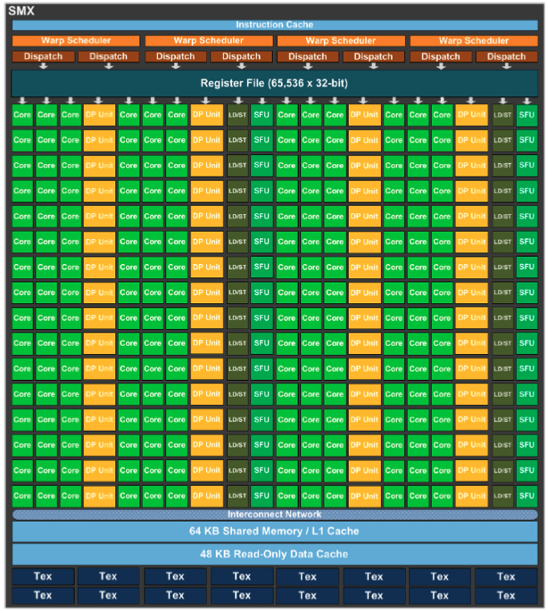
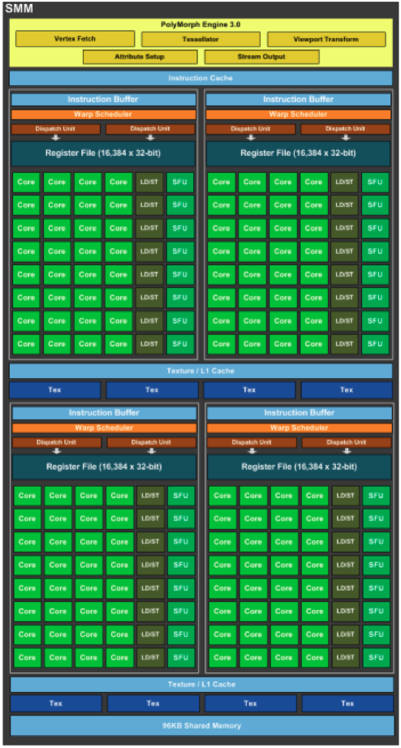
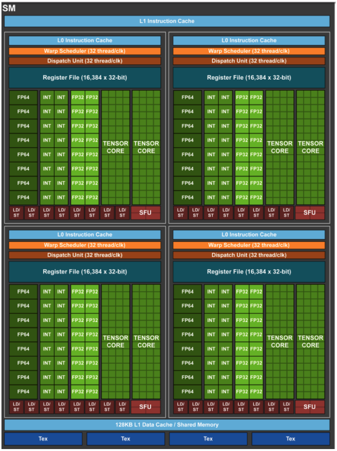
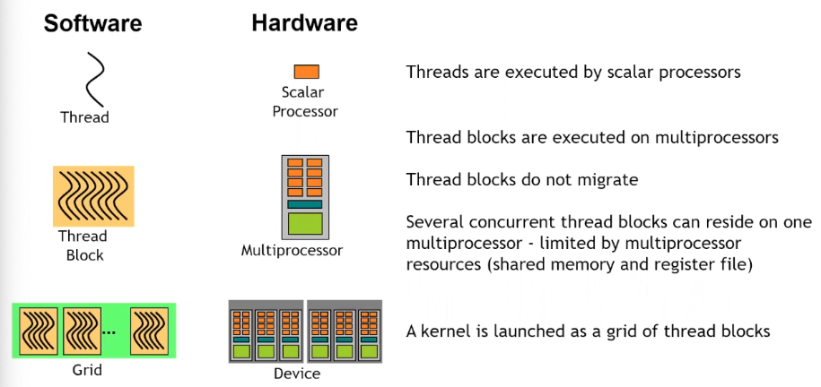

# GPU Architecture

---
The ==streaming multiprocessor== is the core architectural element of the GPU. More ==SMs== means faster GPUs & vice versa. The architectural diagrams on this page are describing a specific generation of the ==streaming multiprocessor== architecture. SMs are composed of cores, so the higher the core count, the more SMs a device contains. The simplest way to increase performance is to add more SMs.

```table-of-contents
```

&nbsp;

# Streaming Multiprocessor Architectures

---

## Kepler

Kepler GPUs, CC3.5, have 192 SP units (cores). ==Single percision== units perform floating point multiplications & additions on 32b data. ==Double percision== units do the same on 64b data. A GPU core does less than an ALU. The closest analog for a processor core in a GPU is the ==streaming multiprocessor==. GPUs are basically load/store architectures, they load data into cores, calculate in the registers & store it back to shared & global memory. Kepler's have 4 ==warp schedulers== which are dual-issue capable, i.e. issue 2 adjacent instructions in a single clock cycle. They are instruction dispatchers at the ==SM== level. Newer iterations will have more SMXs & memory, e.g. K20: 13 SMX's & 5GB.



## Maxwell to Pascal

==Compute Capability==, CC5.2 for Maxwell & CC6.1 for Pascal. The ratio of SP to DP throughput is an in important distinction between generations of GPU architectures. From Kepler to Maxwell & Pascal, this ratio increased, the newer generations having less DP units (Kepler: 1to3). M40, P40, P4 architectures are from the Maxwell & Pascal generation of architectures. They had ~twice as many SMs & ~2-4 times as much memory as the Kepler generation.



## Pascal to Volta

Pascal CC6.0 & Volta CC7.0 added FP16 capability which were twice as fast as SP operations. Tensor cores were also added which have instructions to do matrix*matrix multiplication. Tensor cores gave a 5-10x speedup for matrix operations. P100 & V100: ~50-80SMs & 16-32GB of memory.



## Turing

...

## Jetson

Jetson is a ==system on a chip= environment in which the GPU & the host share exactly the same DRAM memory. The whole idea of memory allocation is different, i.e. there is only one allocation. ==Managed|Unified memory== handles this case as well.

&nbsp;

# GPU Execution Model

---
SMs are analogous to ==multiprocessors== which are the hardware equivalent of ==thread blocks==. To take advantage of multiple SMs, we need multiple thread blocks which are bound to one SM.


A ==warp== is equal to 32 threads. A thread block can have many ==warps==. Instructions are issued at the warp level. This means that each instruction is executed in lock-step by 32 threads at a time.

## Launch Configuration

The launch configuration specifies how many threads the ==grid== has in it & how many ==blocks== those threads reside in, i.e. it specifies the number of blocks & the number of threads per block.
