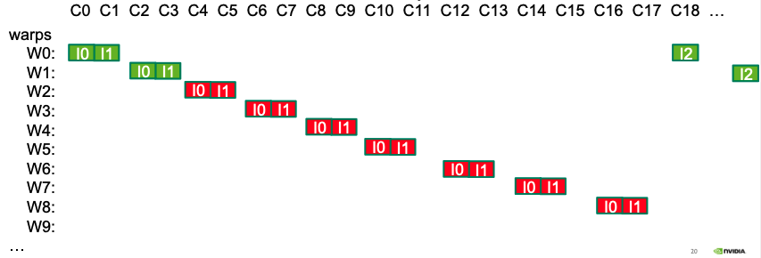
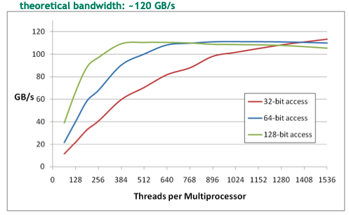
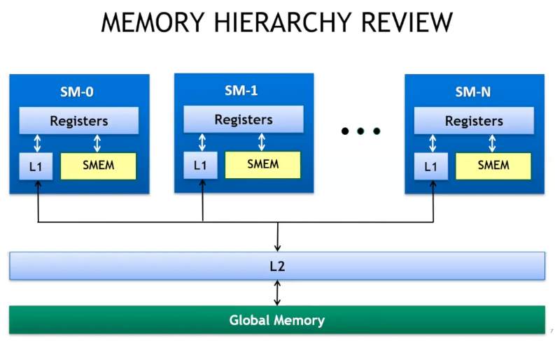
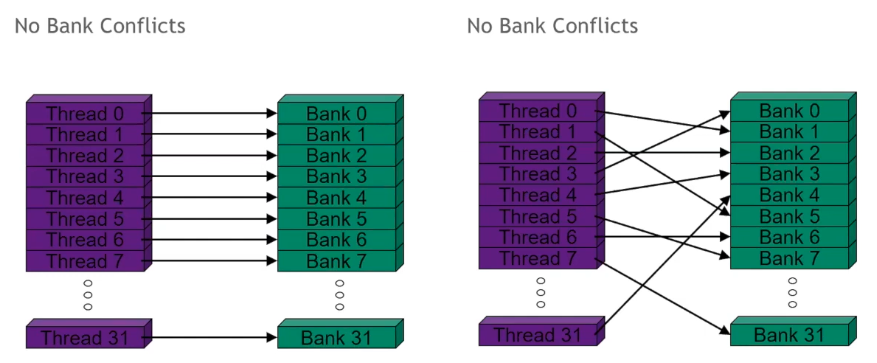
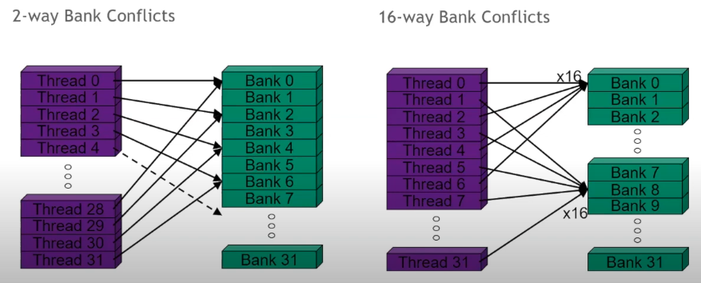
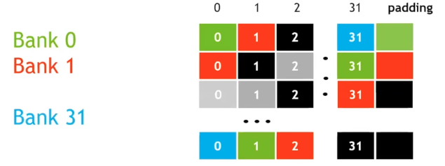
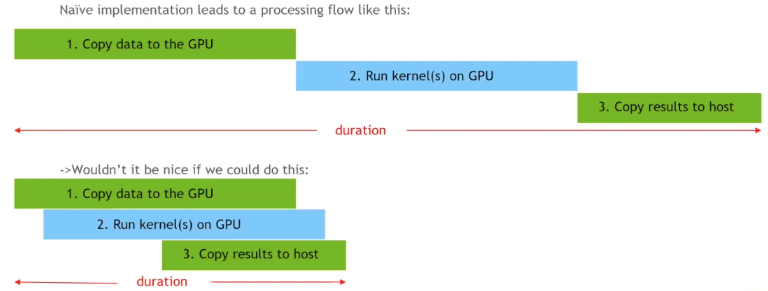
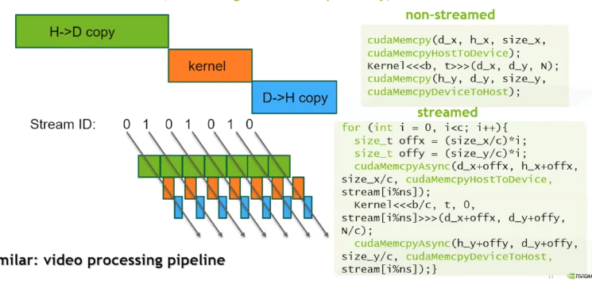
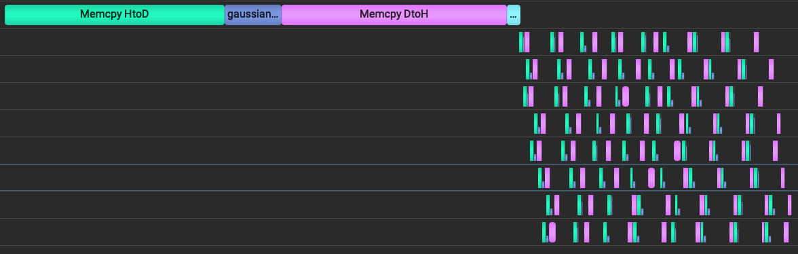
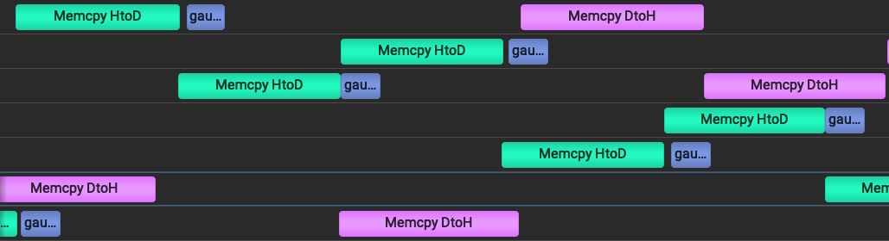

# Kernel Optimizations

---

```table-of-contents
minLevel:2
```

&nbsp;

## Launch Configuration

---
The idea is to use lots of threads. Try to max out the number of threads per SM, i.e. achieve ==maximum occupancy==. Ensure that the # of threads per block is a multiple of 32 to get maximum utilization of the warps which use 32 threads per warp regardless of actual usage. 128, 256, & 512 are commonly good choices for threads per block but the decision ultimately rests on the use case. >512 threads is usually not a good idea because it generally forces the # of blocks per SM to be <2. We always want at least 2 blocks per SM. GPU threads are in order processors of instructions. Threads stall when one of their operands are not ready. Memory reads themselves do not stall, i.e. there can be essentially infinite memory reads simultaneously. ==Global memory latency (GMEM)== is >100 cycles. ==Arithmetic latency== <100 cycles.

==How many threads should we launch?== We want enough threads to hide latency. Latency is hidden by ==switching threads==. To understand this, it is useful to look at CUDA assembly code, ==streaming assembler (SASS)== (the CUDA ISA is called ==PTX==).

```cpp
int idx = threadIdx.x + blockIdx.x * blockDim.x;
c[idx] = a[idx] * b[idx];
```

What does a simple vector multiplication look like in ==SASS==?

```asm
LD R0, a[idx]
LD R1, b[idx]
MPY R2,R0,R1
```

The block level scheduler issues instructions at the ==warp== level. ==SMs== are in order instruction processors, so the scheduler only issues one instruction per clock cycle, so to get all warps in a block processing some instruction takes, e.g., 2 cycles per warp to get both load instructions executing. Those load instructions have latency & the more warps we have per block, i.e. the more threads we have per block, the less time the processor will waste with ==stalled warps==. Pre-Turing architecture allowed, at most, 2048 threads & 64 warps per SM. These architectures also limit blocks per SM to 32.



&nbsp;

## Memory Throughput

---
There are a few ways to maximize ==global memory throughput==. They depend on access patterns & word sizes. Larger accesses, e.g. 128-bit, can achieve the same bandwidth as smaller ones, <=32-bits, using less threads. If one thread has independent loads & stores it can increase throughput.



In the ==gpu memory heirarchy==, ==local storage== consists of ==threads== with their own ==registers== which are managed by the ==compiler==. Then, there is ==shared memory== which is configurable & usually >=48KB, has thread-block level scope with very low latency & high throughput, >1TB/s in aggregate. Next, are the ==L1 & L2== caches. ==L1== is a ==SM== level resource while ==L2== is a device level resource. ==Global memory== access is device wide is has >100s latency but also high throughput, 900GB/s. The high throughput global memory is one of the most distinguishing characteristics of ==GPUs==.



==Non-caching== load operations are possible with the `-Xptxas -dlcm=cg` compiler flags & invalidate the L1 cache line, only attempting to hit L2 before moving to global memory (32B load granularity in DRAM - 1 ==segment==).

==Coalescing== refers to when a warp (32 threads) requests memory addresses that all fall within some set of ==memory segments==. The GPU will only request memory once instead of 32 times for example. If the addresses requested fit into one line or segment (==128 bytes==), then the ==memory bus== will have 100% utilization. On the other hand, if every thread in a warp accesses the same memory index, e.g. `int c = a[40];`, then bus utilization will be very low. There are other expensive patterns that are essentially random memory access, `int c = a[rand()];`, in which each warp may access data without locality to other thread load operations. This random pattern is better when using ==non-caching load operations== because when the L1-cache is skipped, then memory memory segments go from 128B to ==32B== which increases bus utilization. E.g. let's say that a warp needs 128B from memory using a random access pattern, then it will have to request `32 * 128` bytes from L1 which is `128/(32 * 128)` bus utilization. If it uses ==non-caching loads== then it only needs `32 * 32` bytes which increases utilization by a factor of four. Here are a few general principals to keep in mind.

1. Strive for perfect Coalescing.
2. Keep the bus saturated with concurrent accesses by processing several elements per thread.
3. Launch enough threads to maximize throughput.
4. Use all the caches (constant & read-only caches).

## Shared Memory

---
Is used for inter-thread communication within blocks, reducing global memory accesses, & to improve global memory access patterns. It is organized into ==32 banks== which are each ==4B wide==. Each access to shared memory is issued at the warp level & can return one item from each bank per operation. It's possible to make ==columnar requests== to shared memory which access e.g. bytes 0-3 & 128-131 from different threads in the same warp, but these operations would have to be serialized & it's best to avoid them. A worst case scenario would be to have a warp making 32 serialized shared-memory accesses. On the other hand, ==multicast==, is access to the same address in shared memory within a warp & it occurs no penalty. ==Avoid bank conflicts==! An ==n-way bank conflict== causes `1/N` performance degradation.




There are clever ways to avoid bank conflicts that involve using padding. See the ==matrix transpose== article in suggested reading for an in-depth treatment. The following illustration shows how adding some padding will cause the threads in a warp to access the banks at offset times avoiding conflicts.



## Concurrency

---
To motivate our first improvement, let's look at a timeline for our CUDA kernel launch sequence.


If we could make our three steps happen concurrently, we have a lot to gain. One tool that can help achieve that is called ==pinned memory== or ==non-pageable== memory. Most operating systems are ==demand-paged==, i.e. they allocate virtual memory to a process when it asks for memory allocation, but only bring in a page (actual RAM) when the requesting process tries to use it. This means that we can encounter an overhead anytime we or managed memory try to access memory we've allocated on the host. ==Pinned memory== is different, when requested, the system will allocate that memory immediately & keep it fixed in place for the duration of our program. One limit to this is that you cannot pin more memory than what is physically available. The relevant CUDA api is as follows.

1. ==cudaHostAlloc== & ==cudaFreeHost== - allocate pinned memory
2. cudaHostRegister & ==cudaHostUnregister== - pin memory after allocation

==CUDA streams== are another tool we need to achieve concurrency. Our basic ==cudaMemcpy== APIs are blocking calls, the CPU thread that invokes them blocks, but it doesn't have to. It is possible to be copying memory to & from a device at the same time as a kernel is executing. ==Streams== on CUDA GPUs are synchronous executions of issue order operations, but we can have multiple streams whose operations are interleaved. The default mode of operation is to use one stream. Asynchronous copies of memory in either direction require pinned memory, if it is not provided, then the copy of memory will block the host thread. The streams API works like this:

```cpp
// declaration & creation of streams
cudaStream_t stream1, stream2;
cudaStreamCreate(&stream1);
cudaStreamCreate(&stream2);

// launch memory copy & kernel, potentially overlapped
cudaMemcpyAsync(dst, src, size, direction, stream1);
// instead of the null stream, we use stream2
kernel<<<grid, block, 0, stream2>>>(...);

// test if stream is idle
cudaStreamQuery(stream1);
// force CPU thread to wait
cudaStreamSynchronize(stream2);
cudaStreamDestroy(stream2);
```



The for-loop above is known as depth-first issue order, but it also possible to write separate for-loops for each section of the CUDA sequence, but in practice, breadth-first issue order achieves less desirable performance. There is some limited number of streams. CUDA streams can be assigned priority during creation which lets the ==GPU block scheduler== know to attempt to schedule high priority blocks before lower priority blocks.

```cpp
// get the range of stream priorities for this device
int priority_high, priority_low;
cudaDeviceGetStreamPriorityRange(&priority_low, &priority_high);

// create streams with highest and lowest available priorities
cudastream_t st_high, st_low;
cudastreamCreatewithPriority(&st_high, cudaStreamNonBlocking, priority_high);
cudastreamCreatewithPriority(&st_low, cudaStreamNonBlocking, priority_low);
```

### Copy Compute Overlap Refactor & Analysis

This kernel invocation calculates a Gaussian PDF.

```cpp
cudaMemcpy(d_x, h_x, ds * sizeof(ft), cudaMemcpyHostToDevice);
gaussian_pdf<<<(ds + 255) / 256, 256>>>(d_x, d_y, 0.0, 1.0, ds);
cudaMemcpy(h_y1, d_y, ds * sizeof(ft), cudaMemcpyDeviceToHost);
cudaCheckErrors("non-streams execution error");
```

Refactor of the above to overlap data copy & compute. Pinned memory must be used or the result will be that the allocations block the host thread.

```cpp
cudaStream_t streams[num_streams];
for (int i = 0; i < num_streams; i++) {
  cudaStreamCreate(&streams[i]);
}
cudaCheckErrors("stream creation error");

// cudaHostAlloc & cudaFreeHost allocate pinned memory
ft *h_x, *d_x, *h_y, *h_y1, *d_y;
cudaHostAlloc(&h_x, ds * sizeof(ft), cudaHostAllocDefault);
cudaHostAlloc(&h_y, ds * sizeof(ft), cudaHostAllocDefault);
cudaHostAlloc(&h_y1, ds * sizeof(ft), cudaHostAllocDefault);
cudaMalloc(&d_x, ds * sizeof(ft));
cudaMalloc(&d_y, ds * sizeof(ft));
cudaCheckErrors("allocation error");

// NCHUNKS divides DS evenly but that's not common. Instead,
// we handle the possibility of a smaller last chunk on the first line of the loop.
int cChunk = (ds + NCHUNKS - 1) / NCHUNKS;
size_t sChunk = cChunk * sizeof(ft);
int lcChunk = ds - ((NCHUNKS - 1) * cChunk);
size_t lsChunk = (ds * sizeof(ft)) - ((NCHUNKS - 1) * sChunk);
int nBlocks = ((ds / NCHUNKS) + BLOCK_SIZE - 1) / BLOCK_SIZE;

unsigned long long et0 = dtime_usec(0);
for (int i = 0; i < NCHUNKS; i++) {
  if (i == NCHUNKS - 1) {
    cChunk = lcChunk;
    sChunk = lsChunk;
  }

  int xIdx = i * cChunk;
  cudaMemcpyAsync(d_x + xIdx, h_x + xIdx, sChunk, cudaMemcpyHostToDevice,
                  streams[i % num_streams]);
  gaussian_pdf<<<nBlocks, BLOCK_SIZE, 0, streams[i % num_streams]>>>(
      d_x + xIdx, d_y + xIdx, 0.0, 1.0, cChunk);
  cudaMemcpyAsync(h_y + xIdx, d_y + xIdx, sChunk, cudaMemcpyDeviceToHost,
                  streams[i % num_streams]);
}

cudaDeviceSynchronize();
cudaCheckErrors("streams execution error");

et1 = dtime_usec(et1);
std::cout << stream elapsed time : " << et1 / (float)USECPSEC
          << std::endl;
```

Screenshots from NVidia ==Nsight Systems== depict the sequential & concurrent implementations of the copy-compute cycle on a timeline. On EC2 compute, the program was simply compiled with `nvcc -o overlap overlap.cu` & Nsight Systems was run on the host machine (mac) & connected through SSH to the directory of the object file & given the command `./overlap`. The overlapped copy-compute process takes roughly half of the time of the sequential implementation on the LHS of the screen.


Zooming in on the parallelized portion on the RHS above we can see that each of the eight streams is processing one chunk of the data at a time.


## Multi-GPU Programming

---
All kernel launches must happen on the stream associated with current device. The API for multiple GPU operations is as follows:

```cpp
cudaGetDeviceCount(int* count);
cudaSetDevice(int device);
cudaGetDevice(int* device);
cudaGetDeviceProperties(cudaDeviceProp* prop, int device);
cudaMemcpyPeerAsync(..);

// These calls allow streams to depend on other streams, use sparingly.
cudaStreamWaitEvent();
cudaEventQuery();
```

A simple example of running different streams on separate devices is shown here:

```cpp
cudaSetDevice(0);
cudastreamCreate(&streamO);

cudaSetDevice(1);
cudaStreamCreate(&stream1);
kernel<<<b, t, 0, stream1>>>(...);

cudaSetDevice(0);
kernel<<<b, t, 0, streamO>>>(...);
```

Here is an example of peer to peer transfer:

```cpp
cudaSetDevice(0);
cudaDeviceCanAccessPeer(&canPeer, 0, 1);
cudaDeviceEnablePeerAccess(1, 0);

cudaSetDevice(1);
cudaDeviceEnablePeerAccess(0, 0);

//dev 1 to dev 0 copy
cudaMemcpyPeerAsync(dst_ptr, 0, src_ptr, 1, size, stream0);
cudaDeviceDisablePeerAccess(0);
```

### Multi-GPU Refactor
