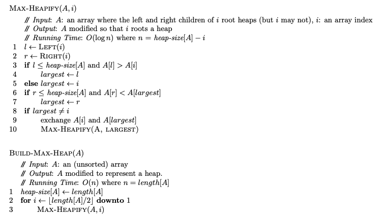
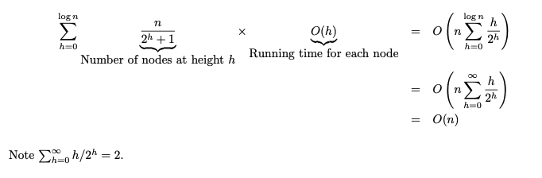

# Heaps & Queues

---
Heaps & queues are data structures whose characteristics lend themselves to efficient solutions of certain problems. E.g. heaps allow `logn` insertion & deletion of elements in order. This can allow its user to avoid searching a list n times & allow an `nlogn` solution instead of an `n^2` one.

```table-of-contents
```

&nbsp;

# Heapify

---
How can a size N tree, usually passed in as an array, be rearranged in `O(n)` so that its nodes all satisfy the heap property, i.e. every node in the tree has a value `>=` (max heap) or `<=` (min heap) than its children.

## Algorithm



## Python Implementation

```python
def maxHeapify(A, i):
    left = 2 * i + 1
    right = 2 * i + 2
    largest = i
    if left < len(A) and A[left] > A[largest]:
        largest = left
    if right < len(A) and A[right] > A[largest]:
        largest = right
    if largest != i:
        A[i], A[largest] = A[largest], A[i]
        A = maxHeapify(A, largest)
    return A


def buildMaxHeap(A):
    for i in range(len(A) // 2, -1, -1):
        A = maxHeapify(A, i)
    return A
```

## Complexity

The cost of a call to `maxHeapify` is `O(h)`, a node may have to swap from its height, `h` times, to a leaf. The last level on a binary tree has at most `n/2` nodes & makes 0 calls to `maxHeapify`, the next level has `n/2^2` nodes & makes at most `n/2^2` calls to max heapify. As we approach the height of the root node, `h` increases. If we sum over the calls to `# of maxHeapify calls * O(h) of each call`, we have the following:


&nbsp;

# Last Stone Weight

---
Given an array of integers representing the weights of stones, smash the two heaviest stones together repeatedly until one or no stones remain. If a stone is heavier it survives the smashing with a new weight less the weight of the lighter stone. Stones equal in weight are both destroyed when smashed together.

## Explore

1. Use a heap (logk insert/retrieve) to store the stone weights.
2. Keep popping the heaviest two stones & smashing them, inserting any left over stone.
3. When 1 or no stones remain, return the weight of them.
Note: Using a second heap could speed things up in practice but not in theory.

## Python Solution

```python
from heapq import heappush, heappop, heapify


class Solution:
    def last_stone_weight(self, S) -> int:
        N = len(S)
        # heapify in place is O(n) < N insertions
        # python heap implementation is a min heap -> use negatives
        for i in range(N):
            S[i] = -S[i]
        heapify(S)

        while len(S) > 1:
            a = -heappop(S)
            b = -heappop(S)
            if a != b:
                heappush(S, -(max(a, b) - min(a, b)))

        if len(S) == 0:
            return 0

        return -S[0]
```

## Complexity

We construct a size `N` heapq in place, [[#Heapify]], in `N` time & pop its top two items repeatedly in constant time, pushing at most one item back into the heap each time for a max `n-1` iterations. Each insertion into the heap is `logn`, therefore, we have an `O(nlogn)` time & `O(n)` space solution.
