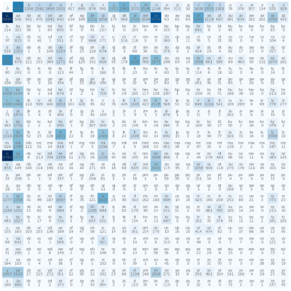
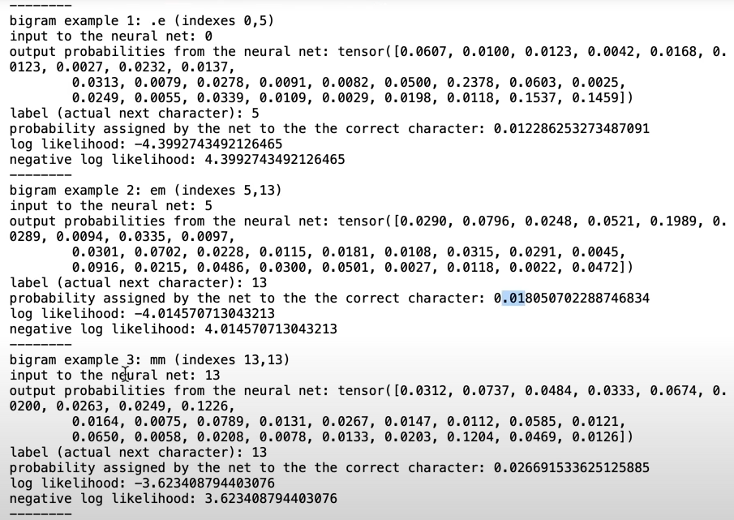

# Transformers From Scratch

---
These are my notes from ==Karpathy=='s ==makemore== series. He explains Transformers from ==biagram models== to ==RNN==s all the way through [[20240409-100535-transformers#transformers|Transformers]]. The concepts in each subsequent model build upon the previous models.

```table-of-contents
minLevel:2
```

The culminating work is ==GPT2== from scratch in Jupyter notebooks.

## Bigram Character Level Language Models

---
The n-gram model is a character level language model that, given a sequence of characters, generates the next character. In this example, we use the ==average negative log likelihood== as our loss function whose goal is to maximize the probability of the training data by minimizing the negative log likelihood. The average is obtained by dividing by `N` which is just normalization. We explore a couple of different model implementations here.

### Bigram Occurrence Matrix

The first model we look at uses a matrix of counts to make predictions. The rows represent the number of times the ith character is seen first & the columns represent the number of times the ith character is seen second. The `.` character is used as the beginning & ending character of each in our example. The result of this matrix ends up identical to the result of the single layer NN due to the input of the NN being a one-hot vector which just picks out a row of the `W` matrix. The big downside is that if we wanted to scale to an ==n-gram== model, we'd need to keep adding dimensions to this ==occurrence matrix== which would not scale.

```python
# process the input file with a name on each line
words = open("./names.txt", "r").read().splitlines()
bigrams = torch.zeros([27, 27], dtype=torch.int32)
all_chars = sorted(list(set("".join(words))))
stoi = {s: i + 1 for i, s in enumerate(all_chars)}
stoi["."] = 0
itos = {i: s for s, i in stoi.items()}

# populate bigrams with the counts of each possible bigram
for word in words:
    chars = ["."] + list(word) + ["."]
    if len(chars) == 2:
        raise Exception("no word")
    for ch1, ch2 in zip(chars, chars[1:]):
        bigrams[stoi[ch1], stoi[ch2]] += 1

# plot the matrix of bigrams, i.e. the bigram occurrence matrix
plt.figure(figsize=(14, 14))
plt.imshow(bigrams, cmap="Blues")
for i in range(len(bigrams)):
    for j in range(len(bigrams[0])):
        str = itos[i] + itos[j]
        plt.text(j, i, str, ha="center", va="bottom", color="grey")
        plt.text(j, i, bigrams[i, j].item(), ha="center", va="top", color="grey")
plt.axis("off")
```



```python
# Model smoothing, get rid of 0 values & normalize the row probabilities
P = (bigrams + 1).float()
P /= P.sum(1, keepdim=True)

# Token Generation
row = 0  # Start at index 0 - start token
word = ""
while True:
    selected = torch.multinomial(
        P[row], num_samples=1, replacement=True, generator=g
    ).item()
    print(f"selected {itos[selected]} with prob {P[row][selected]}")
    row = selected
    if row == 0:
        break  # 'End' character
    word += itos[row]
print(word)


def calculate_negative_log_likelihood(input, verbose=False):
    loglikelihood = 0.0
    n = 0
    for w in input:
        chars = ["."] + list(w) + ["."]
        for ch1, ch2 in zip(chars, chars[1:]):
            prob = P[stoi[ch1], stoi[ch2]]
            logprob = torch.log(prob)
            # log(a*b*c) = log(a) + log(b) + log(c)
            loglikelihood += logprob
            n += 1
            if verbose:
                print(f"{ch1}{ch2}, prob: {prob:.4f}, logprob: {logprob:.4f}")
    nll = -loglikelihood
    return nll, n


nll, n = calculate_negative_log_likelihood(words)
print(f"average loglikelihood: {nll/n}")
```

### Biagram Neural Network

The bigram model does not, in & of itself, have any way to iteratively maximize the probability of the input. We can evolve this concept into a ==neural network== & then apply gradient descent in order to minimize the negative average log probability of the model input. This is a much more flexible model than [[#Bigram Occurrence Matrix]] which will become evident as we evolve to the ==n-gram== model, this will improve upon the generation quality of the last model because it is able to efficiently scale to more features.

```python
# The first thing to do is create a bigram training set.
# We don't use the occurrences matrix, our inputs matched with our labels will encapsulate the same information.
xs, ys = [], []
for word in words:
    chars = ["."] + list(word) + ["."]
    for ch1, ch2 in zip(chars, chars[1:]):  # iterate all the bigrams from left to right
        xs.append(stoi[ch1])
        ys.append(stoi[ch2])

# training set: x[i] input should have y[i] output
xs = torch.tensor(xs)
ys = torch.tensor(ys)

# Neural Networks take in vector inputs so that they can turn on & off neurons based on the input, so we turn our input into one-hot tensors. If we used an integer instead, our input layer would only have one neuron & it would be hard for our network to learn. We also initialize our weights from the ==normal distribution== which is centered on 0, then we show what an forward propagation through the first layer. This first iteration will have linear layers with no bias & no nonlinear activations.
# import torch.nn.functional as F
xenc = F.one_hot(xs, num_classes=27).float()  # need floats as input to NN
W = torch.randn((27, 27))
xenc @ W

# Now, we have a (5x27) output from our layer with negative & positive floats, but we want something like probabilities, so we exponentiate, i.e. scale our outputs from 0 -> inf by the exponential function. Then we normalize the outputs & they look like probabilities, similar to our logits matrix. These are in fact called ==logits== which are ==log-counts==. Collectively, this operation is known of the ==Softmax activation== function.
counts = logits.exp()
prob = counts/counts.sum(1, keepdim=True)

# Let's examine the input & outputs of our network.
nlls = torch.zeros(5)
for i in range(5):
  x = xs[i].item()
  y = ys[i].item()

  print('---------------')
  print(f'bigram example {i+1}: {itos[x]}{itos[y]} (indexes {x}, {y})')
  print('input to the neural net:', x)
  print('output probabilities from the neural net:', probs[i])
  print('label (actual next character):', y)
  p = probs[i, y]
  print 'probability assigned by the net to the the correct character:', p.item())
  logp = torch.log(p)
  print('log likelihood:', logp.item())
  nll = -logp
  print( 'negative log likelihood:', nll.item())
  nlls[i] = nll
print ('=========')
print( 'average negative log likelihood, i.e. loss =', nlls.mean().item())
```



The next thing to do is adjust our weights optimally so that we can minimize our negative average log likelihood loss. We need a ==training loop== with ==gradient descent== for that.

```python
# y - out output of the training data, for xenc[i] this is the expected next letter in the bigram.
def train(iters=10):
    for i in range(iters):
        print(f"iteration {i}")
        # Forward pass
        logits = xenc @ W
        counts = logits.exp()
        softmax = counts / counts.sum(1, keepdim=True)

        # Calculate loss - NLL
        probs_for_examples = softmax[torch.arange(xenc.shape[0]), ys]
        nll = -probs_for_examples.log()
        loss = nll.mean()
        print(f"loss: {loss}")

        # Backward
        W.grad = None  # Reset the gradient
        loss.backward()

        # Update
        W.data += -15.0 * W.grad


train(1024)

# Finally, we sample for the trained neural network as follows:
name_sample = ""
input = 0  # Start character
while True:
    ienc = F.one_hot(torch.tensor([input]), num_classes=27).float()
    # Forward
    logits = ienc @ W

    # Softmax - transform the output of NN into distribution on probabilities
    counts = logits.exp()
    softmax = counts / counts.sum(1, keepdim=True)
    character_sample = torch.multinomial(softmax, num_samples=1, generator=g).item()

    # process sample
    if character_sample == 0:
        break
    name_sample += itos[character_sample]

print(name_sample)
```

We can abstract this functionality into a PyTorch module to make it easy to integrate & reuse.

```python
class Bigram(nn.Module):
    """
    Bigram Language Model 'neural net', simply a lookup table of logits for the
    next character given a previous character.
    """

    def __init__(self, config):
        super().__init__()
        n = config.vocab_size
        self.logits = nn.Parameter(torch.zeros((n, n)))

    def get_block_size(self):
        return 1  # this model only needs one previous character to predict the next

    def forward(self, idx, targets=None):
        logits = self.logits[idx]

        # if we are given some desired targets also calculate the loss
        loss = None
        if targets is not None:
            loss = F.cross_entropy(
                logits.view(-1, logits.size(-1)), targets.view(-1), ignore_index=-1
            )

        return logits, loss
```
