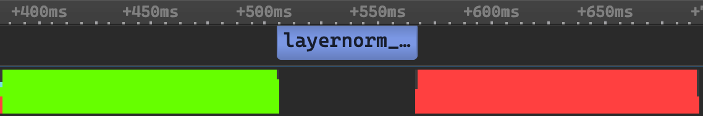
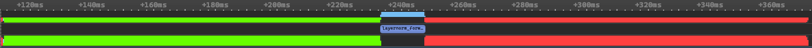
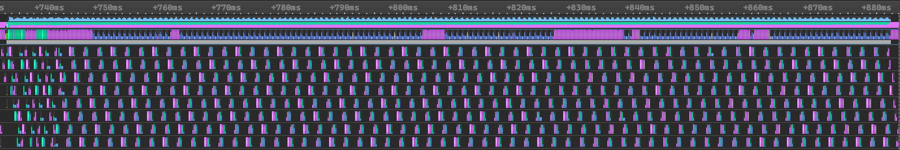
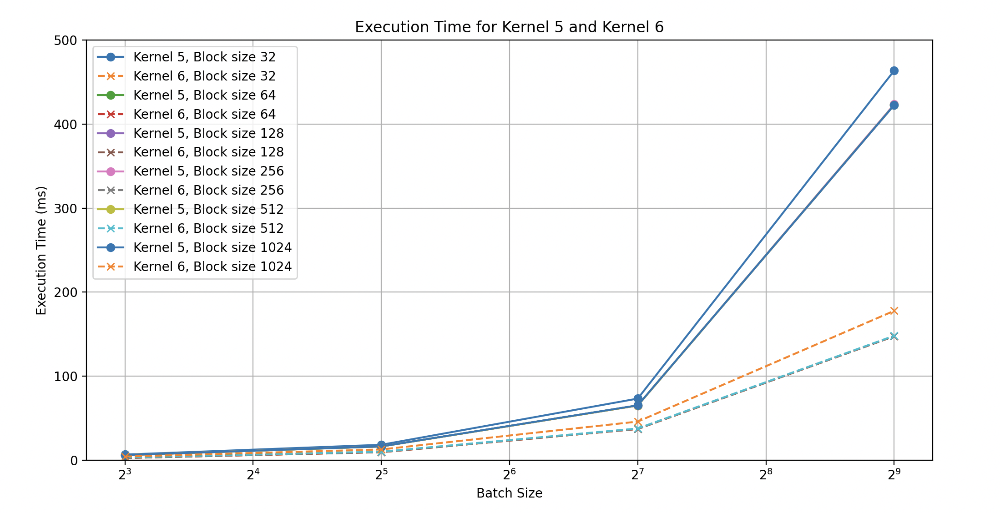
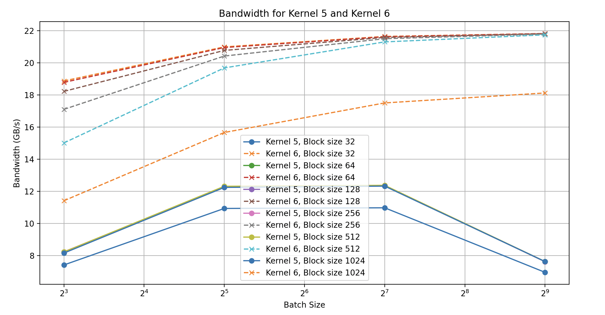

# llm.c

---
This is ==Andrej Karpathy's== deep dive on ==LLMs== using ==C & CUDA==. It contains GPU & CPU kernels for many important operations which have been progressively iterated on, an incredibly valuable learning opportunity. My goal here is to learn everything I can from this repository & to profile it & see where I might be able to make some improvement or contribution. This sort of exercise is incredibly valuable experience, it should help me get faster at analyzing & comparing kernels & figuring out how to improve them. It's an opportunity to improve my profiling & debugging abilities & overall workflow in ==C & CUDA== applications.

```table-of-contents
minLevel:2
```

## Agenda

- [ ] Step through the execution, noting what happens & how things work. Study interesting kernels & how they progressively improve.
- [ ] Note any observations about potential new kernels or improvements to existing kernels.
- [x] Profile a CUDA kernel & do some analysis.
- [x] Implement the simplest improvement available.

## The Code Base

---
After trying to run the training loop on a couple of EC2s, I had to put in another `g6.*` spot instance request because the tokenizer was running out of CPU memory & my quota was too low (vCPUs) to run a large enough instance. So, I thought I'd just get right into the kernels to see if I can make an immediate contribution. The kernels are incredibly well organized & come with benchmarking & CPU implementation verification in the same file.

## Copy Compute Overlap

---
The first kernel I pulled up, `layernorm_forward_kernel*` has 5 different iterations. The first thing I noticed is that none of them are using any ==copy compute overlap== which is relatively low hanging fruit that can prove to be dramatic, so let's try to make it happen. First thing's first, I need to understand what `layernorm_forward` is doing & whether or not/how we can chunk it for the overlap. For that, we look at the conveniently provided CPU reference implementation. The code was already well commented but I consolidated & rewrote some comments here to help orient myself.

```c
void layernorm_forward_cpu(float* out, float* mean, float* rstd,
                           const float* inp, const float* weight,
                           const float* bias, int B, int T, int C) {

  // B: batch size, T: tokens (sequence length), C: channels (embedding dimensionality)
  float eps = 1e-5f;
  for (int b = 0; b < B; b++) {
    for (int t = 0; t < T; t++) {

      // calculate the mean, variance, & rstd (relative) of each channel
      const float* x = inp + b * T * C + t * C;
      float m = 0.0f;
      for (int i = 0; i < C; i++) {
        m += x[i];
      }
      m = m / C;

      float v = 0.0f;
      for (int i = 0; i < C; i++) {
        float xshift = x[i] - m;
        v += xshift * xshift;
      }
      v = v / C;
      float s = 1.0f / sqrtf(v + eps);

      // normalize the output & apply the layernorm scale & shift parameters
      float* out_bt = out + b * T * C + t * C;
      for (int i = 0; i < C; i++) {
        float n = (s * (x[i] - m));
        float o = n * weight[i] + bias[i];
        out_bt[i] = o;
      }

      // cache the mean and rstd for the backward pass later
      mean[b * T + t] = m;
      rstd[b * T + t] = s;
    }
  }
}
```

### How can this calculation be broken down into smaller pieces?

1. The most obvious idea is to send some number of training samples at a time instead of a whole batch.
2. If the batch size isn't large enough to plenty copy latency, then our solution will be less trivial, i.e. we'd need to chunk each training example into smaller pieces, & combine them at the end, probably by just calling the kernel another time.

While option#2 sounds like a fun challenge, let's try the simplest idea first. What sort of speedup can be obtained from copying N chunks of training samples at a time to the GPU while computing on each chunk concurrently.

### Initial Benchmark & Profile

Compile & run the naive `layernorm_forward` implementation.

```bash
nvcc -O3 --use_fast_math -lcublas -lcublasLt layernorm_forward.cu -o layernorm_forward
./layernorm_forward 1
```

```txt
        block_size   32 | time 0.6130 ms | bandwidth 82.11 GB/s
        block_size   64 | time 0.6623 ms | bandwidth 75.99 GB/s
        block_size  128 | time 0.7474 ms | bandwidth 67.35 GB/s
        block_size  256 | time 0.7726 ms | bandwidth 65.15 GB/s
        block_size  512 | time 1.1350 ms | bandwidth 44.34 GB/s
        block_size 1024 | time 2.2261 ms | bandwidth 22.61 GB/s
```

Profile the first iteration of the kernel & visualize it with ==Nsight Systems== to see what we're missing out on in the absence of the copy compute overlap. This data was generated with a batch size of 512 using the slowest kernel, ==kernel#1==.

We spend `~2ms` setting & copying memory onto the device, `<1ms` computing on device, & `~13ms` copying from device to host. This implies that we're spending ==~93%== of our time copying data to & from the device & data copying is the bottleneck. If we utilize [[20240428-161112-kernel-optimizations#concurrency|CUDA streams]], overlapping copy & compute, making all these operations concurrent, then we can expect to speed things up quite a bit. The larger the batch size the more dramatic I would expect this to be in theory, let's see what happens in practice.

### Implementation

The first thing I did after thinking about the above profile was to reorganize the benchmarking code to include all memory copying from the host to the device & vice versa. This is important given that we found that the vast majority (93%) of time in the ==layernorm_forward== implementation is spent on memory copies. The copy compute overlap implementation was fairly straight forward pointer math as shown below. The much more involved task was getting the benchmark to reflect the memory copy data & then fixing the numerical issues that come up in the latency calculation. For more detail on that refactoring, you can see the PR.
<!--TODO: link the PR above when ready.-->

```c
void layernorm_forward6(float* d_out, float* d_mean, float* d_rstd,
                        float* d_inp, float* d_weight, float* d_bias,
                        float* out, float* mean, float* rstd, float* inp,
                        float* weight, float* bias, int B, int T, int C,
                        const int block_size, cudaStream_t* streams,
                        int nStreams) {
  const int nChunk = 1;
  const int N = nChunk * T;
  size_t sToken = C * sizeof(float);
  const int grid_size = ceil_div(N, block_size);

  cudaCheck(cudaMemcpyAsync(d_weight, weight, sToken, cudaMemcpyHostToDevice,
                            streams[0 % nStreams]));
  cudaCheck(cudaMemcpyAsync(d_bias, bias, sToken, cudaMemcpyHostToDevice,
                            streams[1 % nStreams]));
  // no guarantee that our weights & biases are copied before we start computing -> sync
  cudaDeviceSynchronize();

  for (int b = 0, sNum = 0; b < B; b += nChunk, sNum = (sNum + 1) % nStreams) {
    cudaMemcpyAsync(d_inp, inp, N * sToken, cudaMemcpyHostToDevice,
                    streams[sNum]);
    layernorm_forward_kernel1<<<grid_size, block_size, 0, streams[sNum]>>>(
        d_out, d_mean, d_rstd, d_inp, d_weight, d_bias, N, C);
    cudaMemcpyAsync(out, d_out, N * sToken, cudaMemcpyDeviceToHost,
                    streams[sNum]);
    cudaMemcpyAsync(mean, d_mean, N * sizeof(float), cudaMemcpyDeviceToHost,
                    streams[sNum]);
    cudaMemcpyAsync(rstd, d_rstd, N * sizeof(float), cudaMemcpyDeviceToHost,
                    streams[sNum]);

    d_out = d_out + N * C;
    out = out + N * C;
    d_mean = d_mean + N;
    mean = mean + N;
    d_rstd = d_rstd + N;
    rstd = rstd + N;
    d_inp = d_inp + N * C;
    inp = inp + N * C;
  }

  cudaDeviceSynchronize();
  cudaCheck(cudaGetLastError());
}
```

### Contrasting Profiles

==Kernel#6== is just kernel#1 with a ==copy compute overlap== implementation. Across a range of batch sizes & block sizes, it turns out that the most naive kernel is ==~185%== faster than the most complicated one if you apply the copy compute overlap to it. The following screenshot is of ==kernel#5== which is the fastest kernel for ==layernorm_forward== in the ==llm.c== repository. It does not overlap copy & compute.


It's easy to see from the above profile, that without the copy compute overlap, the vast majority of computation time is spent just copying data from the host to the device & from the device back to the host. In stark contrast, the following profile shows the slowest kernel, ==kernel#1==, with the ==copy compute overlap== implemented. There are `8` streams interleaving copy & compute concurrently, & interestingly enough, it looks like the ==runtime of this improvement is approximately equal to one of the memcpy operations in the kernel#5 run==. This profile is a beautifully efficient example of latency hiding with densely interleaved copy & compute.


### Contrasting Benchmarks

==What should we expect when we benchmark the new solution against the previous fastest kernel?== We saw that kernel launch & computation was less than ==10%== of the runtime in the data we sampled & we saw that the improved kernel with the copy compute overlap took approximately the time of one of the memcpy operations in kernel#5. We might expect to be approximately twice as fast in general. Let's see what the data say.

We see that execution time in the data we sampled is approximately ==3x== as fast when we include the copy compute overlap. Below, we see more evidence that memory operations dominate as kernel#5's bandwidth degrades as the batch size increases while kernel#6s bandwidth continues to improve with the size of the input.

Something interesting is happening with the performance of kernel#5, as the input size scales its performance degrades (an investigation for another time). The raw data is included below for reference.

```txt

    Using kernel 5
    Batch size 8
    block_size   32 | time 6.7916 ms | bandwidth 7.41 GB/s
    block_size   64 | time 6.1266 ms | bandwidth 8.22 GB/s
    block_size  128 | time 6.1385 ms | bandwidth 8.20 GB/s
    block_size  256 | time 6.1181 ms | bandwidth 8.23 GB/s
    block_size  512 | time 6.1230 ms | bandwidth 8.22 GB/s
    block_size 1024 | time 6.1786 ms | bandwidth 8.15 GB/s

    Using kernel 6
    Batch size 8
    block_size   32 | time 2.6678 ms | bandwidth 18.87 GB/s
    block_size   64 | time 2.6806 ms | bandwidth 18.78 GB/s
    block_size  128 | time 2.7630 ms | bandwidth 18.22 GB/s
    block_size  256 | time 2.9435 ms | bandwidth 17.10 GB/s
    block_size  512 | time 3.3532 ms | bandwidth 15.01 GB/s
    block_size 1024 | time 4.4129 ms | bandwidth 11.41 GB/s

    Using kernel 5
    Batch size 32
    block_size   32 | time 18.4197 ms | bandwidth 10.93 GB/s
    block_size   64 | time 16.4180 ms | bandwidth 12.26 GB/s
    block_size  128 | time 16.4408 ms | bandwidth 12.25 GB/s
    block_size  256 | time 16.4208 ms | bandwidth 12.26 GB/s
    block_size  512 | time 16.3559 ms | bandwidth 12.31 GB/s
    block_size 1024 | time 16.4433 ms | bandwidth 12.24 GB/s

    Using kernel 6
    Batch size 32
    block_size   32 | time 9.5934 ms | bandwidth 20.99 GB/s
    block_size   64 | time 9.6114 ms | bandwidth 20.95 GB/s
    block_size  128 | time 9.6933 ms | bandwidth 20.77 GB/s
    block_size  256 | time 9.8574 ms | bandwidth 20.42 GB/s
    block_size  512 | time 10.2313 ms | bandwidth 19.68 GB/s
    block_size 1024 | time 12.8589 ms | bandwidth 15.66 GB/s

    Using kernel 5
    Batch size 128
    block_size   32 | time 73.3873 ms | bandwidth 10.97 GB/s
    block_size   64 | time 65.2572 ms | bandwidth 12.34 GB/s
    block_size  128 | time 65.1848 ms | bandwidth 12.35 GB/s
    block_size  256 | time 65.1315 ms | bandwidth 12.36 GB/s
    block_size  512 | time 65.1106 ms | bandwidth 12.37 GB/s
    block_size 1024 | time 65.3476 ms | bandwidth 12.32 GB/s

    Using kernel 6
    Batch size 128
    block_size   32 | time 37.2188 ms | bandwidth 21.64 GB/s
    block_size   64 | time 37.2428 ms | bandwidth 21.62 GB/s
    block_size  128 | time 37.3091 ms | bandwidth 21.58 GB/s
    block_size  256 | time 37.4513 ms | bandwidth 21.50 GB/s
    block_size  512 | time 37.8167 ms | bandwidth 21.30 GB/s
    block_size 1024 | time 46.0104 ms | bandwidth 17.50 GB/s

    Using kernel 5
    Batch size 512
    block_size   32 | time 463.6225 ms | bandwidth 6.95 GB/s
    block_size   64 | time 422.9484 ms | bandwidth 7.62 GB/s
    block_size  128 | time 422.6340 ms | bandwidth 7.62 GB/s
    block_size  256 | time 423.5363 ms | bandwidth 7.61 GB/s
    block_size  512 | time 422.8712 ms | bandwidth 7.62 GB/s
    block_size 1024 | time 422.6967 ms | bandwidth 7.62 GB/s

    Using kernel 6
    Batch size 512
    block_size   32 | time 147.6147 ms | bandwidth 21.82 GB/s
    block_size   64 | time 147.6274 ms | bandwidth 21.82 GB/s
    block_size  128 | time 147.6656 ms | bandwidth 21.81 GB/s
    block_size  256 | time 147.8123 ms | bandwidth 21.79 GB/s
    block_size  512 | time 148.1728 ms | bandwidth 21.74 GB/s
    block_size 1024 | time 177.8033 ms | bandwidth 18.12 GB/s

```
