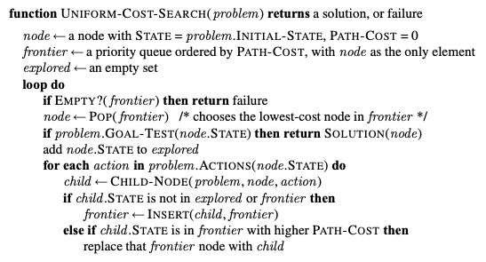

# Uniform Cost Search

---

Uniform Cost Search is a general version of Dijkstra's algorithm. Dijkstra's algorithm is a uniform cost search with with no goal state. UCS finds the shortest path to a goal state given a non-negative weighted graph & a starting state.

```table-of-contents
minLevel: 2
```

## Algorithm

---

UCS is very similar to [[20240226-074659-breadth-first-search|Breadth-First Search]] except for that it uses a step-cost function & a priority queue to determine the order in which it visits nodes. It also does not check for goal states until they have been selected for expansion from the priority queue because it might be the case that there are many path with different costs to a node which is something [[20240226-074659-breadth-first-search|BFS]] doesn't need to worry about.


## Single Source Shortest Paths

---
Given an undirected graph and a starting node, determine the lengths of the shortest paths from the starting node to all other nodes in the graph. If a node is unreachable, its distance is -1. Nodes will be numbered consecutively from to , and edges will have varying distances or lengths.

### Explore

                          5
      2◄─────────┐
      ▲    6     ▼                  Input:
      │5         3 ◄────────► 4       n=4
      ▼    15    ▲     2              graph=[(1,2,5),(1,3,15),(2,3,6),(3,4,2)]
      S/1◄───────┘                    start=1

1. Classic Dijkstra's problem, use Uniform Cost Search version due to its generalizability.
2. Convert the into an adjacency list.
3. Consider edge cases at the end by walking them through the code.

### Python

```Python
from heapq import heapify, heappop, heappush
from typing import Iterable


def add_edge(graph, n, m, c) -> None:
    if n in graph:
        graph[n].append((c, m))
    else:
        graph[n] = [(c, m)]


def build_graph(n, edges) -> dict[int, list[tuple[int, int]]]:
    graph = {}
    for n, m, c in edges:
        add_edge(graph, n, m, c)
        add_edge(graph, m, n, c)
    return graph


def expand(node, graph) -> Iterable[tuple[int, int]]:
    for n in graph[node]:
        yield n


def check_frontier(node, frontier) -> tuple[bool, int]:
    for i, n in enumerate(frontier):
        c, cnode = n
        if cnode == node:
            return (True, i)
    return (False, -1)


def build_soln(dist, explored, s) -> list[int]:
    soln = []
    for i, d in enumerate(dist):
        if i == 0 or i == s:
            continue
        if i not in explored:
            soln.append(-1)
        else:
            soln.append(d)
    return soln


def single_source_shortest_paths(n, edges, s) -> list[int]:
    # add both directions
    graph = build_graph(n, edges)
    dist = [0] * (n + 1)
    explored = set()
    frontier = [(0, s)]

    while frontier:
        _, cnode = heappop(frontier)
        # no goal check needed due to single source all shortest paths
        explored.add(cnode)
        for edge_cost, node in expand(cnode, graph):
            in_frontier, idx = check_frontier(node, frontier)
            tdist = dist[cnode] + edge_cost
            if not in_frontier and node not in explored:
                heappush(frontier, (tdist, node))
                dist[node] = tdist
            elif in_frontier:
                fdist, fnode = frontier[idx]
                if tdist < fdist:
                    frontier[idx] = (tdist, fnode)
                    heapify(frontier)
                    dist[node] = tdist

    # get rid of zero idx, unreachables become -1s, start is removed
    return build_soln(dist, explored, s)
```
