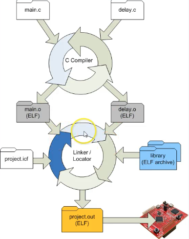
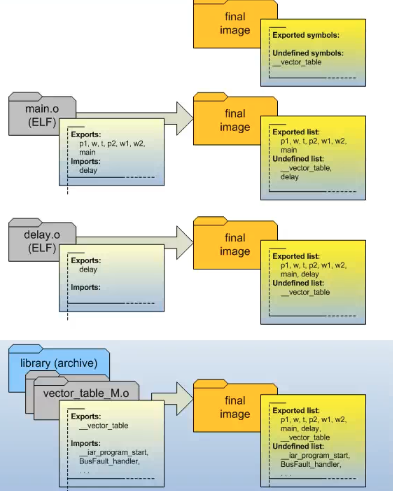
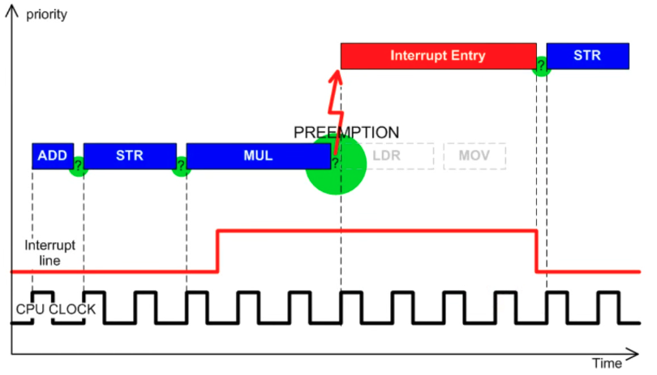

# Embedded Systems

---
An ==embedded system== is a combination of hardware & software designed to perform a specific task usually embedded in a larger device or system.

```table-of-contents
minLevel:2
```

## Read Modify Write Avoidance

---
In embedded systems we want to avoid RMW of bits because of hardware interrupts. If we load some memory into a register, the processor has its PC changed to an ISR by an interrupt, that ISR modifies the GPIO register we wanted to modify, & then returns control flow to us, our RMW sequence is broken & we have a bug. Therefore, embedded systems hardware usually provides us with a way to make atomic writes. The general idea is to provide the user with an address for modifying every possible combination of bits which when used would never modify any other bits thus allowing us to avoid loading the memory address first & doing some bitwise operations. This looks like an array of, e.g. GPIO bits, that we index with hex values which are really just integers whose bitwise representation corresponds to the bit we want to alter.

## Functions & the Call Stack in C

---
The ==SP== register is the ==stack pointer== which points to the top of the stack which grows upward, toward lower addresses in the majority of recent architectures. The ==LR== register is the ==link register== which contains the return address when a function is called. It points to the address of the instruction that called the function. The ==R0== register contains the arguments to a function & then also the return value. This contract between a function & its caller is called the ==APCS | ARM Procedure Call Standard==.

## Structures & Unions in C

---
==Structures== have their members stored in order in memory. The most succinct declaration which allows you to declare the struct a type and give it a type name in one line is as follows:

```c
typedef struct {
  uint8_t x;
  uint8_t y;
} Point;
```

The `__packed` keyword tells the compiler to allow aligning struct members on odd addresses, i.e. do not add padding to avoid this. Accessing packed values might take extra instructions in some processors like ==Cortex M0== where the ==halfword== instructions are only allowed on aligned data. ==Packing== should usually be avoided, but can occasionally be used to save space or speed up operations in data intensive applications. The `__packed` keyword also works in Unions to keep from padding before or after members. The advantages of ==packing== are that:

1. More data can fit into a cache line which reduces cache misses & improves performance.
2. The memory footprint is reduced.
3. The less data that needs transferred, the faster the transfer can be.

==Unions== are like structures except that their members occupy the same space in memory.
&nbsp;

## CMSIS Standard

---
Is this something we want to spend time understanding???????
&nbsp;

## Startup Code

---

### How Do We Arrive @Main?

On the ==CortexM0== processor, the code before main looks something like this:

1. ==Reset Handler==
Called after reset, initializes the ==stack pointer== to the value at 0x0 & the ==program counter== to the value at 0x4 in a 32bit machine. In CortexM machines, only ==thumb mode (16 bit instructions)== is supported (faster & smaller), so the ==PC== must be initialized to an address with the least significant bit =1. The section of memory starting at 0x0 is called the ==vector table==.
2. ==Program Start==
All registers are initialized to zero except the stack pointer. The ==FPU== initializer function is called.
2. ==CMain==
==\__cmain== is called which calls the ==\__low_level_init== function that performs any custom hardware initializations you specified or does nothing if you did not provide an implementation.
3. ==Data Initialization==
A data initialization function is called next which decides where to place all data segments, how to initialize data, & determines what the ==linker map== file output will look like. E.g. all initialized variables will be stored in the ==initializer bytes section== of ROM & copied into the ==.data section== in RAM & all uninitialized variables will be copied into the ==.bss section== in RAM & assigned zero.
4. ==Call Main==
Then, \__call_main is invoked which calls our main function.

### The Embedded Software Build Process

The ==cross compiler== takes in .c & .h files & builds them into ==object files==. One popular format for object files is the ==ELF== format which is not very readable, but ==objdump== can be used to obtain a human readable representation. ELF is a standard & compatible with many different tools.

The object files coming out of the compiler have no address information. The ==linker== takes in the object files, finds dependencies from the ==standard library== or other outside sources, & links them together into another object file. At this point, the ELF file contains ==relocatable code==, i.e. it uses relative addresses or offsets instead of absolute addresses & can run at any memory address. This increases flexibility & enables efficient memory usage.



### ELF Files

Have ==SECTIONS:== which include ==.data==, ==.bss==, & ==.text among others. These correspond to initialized variables, uninitialized variables, & code respectively. The linker has to decide where in memory everything will actually go, so the object files that feed into the linker have offsets, not absolute addresses. Final ELF files are called ==ELF images==. Linkers & compilers are processor specific. Linkers need to know how to fix object file addresses & opcodes for their specific processor.

When building the final image, the linker starts with two sections, ==Exported symbols:== & ==Undefined symbols:==. The vector table is the only entry in either, it appears in the undefined symbols section. For each object file provided to the linker, the linker adds all the exports to the final image exports & all the imports not in the exports to the undefined list. If an export that resolves an undefined item is encountered, it is removed from the undefined list. Next, the linker checks all libraries, standard & otherwise, for items in the undefined list until they are all found or the linker fails with undefined list items remaining.



### The Vector Table & Interrupt Handlers

One of the undefined symbols section entries is the ==__vector_table== which is found in the vector_table_M.o object file & exports the \__vector_table but also imports ==\__program_start== & ==\__BusFault_handler== which are then added to the undefined symbols section. \__program_start is found in cstartup_M.o. Libraries general only have one object or function per module to make it possible to link smaller amounts of code.

In order to provide your own ==vector table==, just define `const int __vector_table[] @ ".intvec" = {}` which will be placed in the export list in the object file produced by the compiler before the linker runs. You have to be careful when writing code for this file because nothing has been set up yet, e.g. the stack pointer is not set, the .bss section has not been cleared, & the .data section has not been copied from ==ROM== to ==RAM==. Most processor startup code has to be written in assembly, but the CortexM series is designed to avoid low level assembly as much as possible. `Const` is there to force the linker to place the vector table in ROM & `@ ".intvec"` is an `IAR` extension that forces the linker to place the vector table in the `.intvec` section at address zero. Here is what the vector table could look like for the ==tm4c== processor:

```c
/* startup code for TM4C MCU */
#include "tm4c_cmsis.h"

extern int CSTACK$$Limit;
void __iar_program_start(void);
void Unused_Handler(void);

int const __vector_table[] @ ".intvec" = {
    (int)&CSTACK$$Limit,        // the lower address limit of the stack.
    (int)&__iar_program_start,  // pointer to main
    (int)&NMI_Handler,  // Non-Maskable Interrupt (e.g. hardware failure, high priority events)
    (int)&HardFault_Handler,  // handles hard faults (not sure what's different, processor specific?)
    (int)&MemManage_Handler,   // memory related faults
    (int)&BusFault_Handler,    // bus faults
    (int)&UsageFault_Handler,  // undefined opcodes
    0,                         /* Reserved */
    0,                         /* Reserved */
    0,                         /* Reserved */
    0,                         /* Reserved */
    (int)&SVC_Handler,  // allows programs to request services from the OS or a higher-privileged mode
    (int)&DebugMon_Handler,  // debugger requests control over the processor
    0,                       /* Reserved */
    (int)&PendSV_Handler,  // allows the processor to handle a service request when it is safe to do so
    (int)&SysTick_Handler,  // allows for the generation of time related events

    /* external interrupts (IRQs) ... */
    (int)&GPIOPortA_IRQHandler,   /* GPIO Port A                  */
    (int)&GPIOPortB_IRQHandler,   /* GPIO Port B                  */
    (int)&GPIOPortC_IRQHandler,   /* GPIO Port C                  */
    (int)&GPIOPortD_IRQHandler,   /* GPIO Port D                  */
    (int)&GPIOPortE_IRQHandler,   /* GPIO Port E                  */
    (int)&UART0_IRQHandler,       /* UART0 Rx and Tx              */
    (int)&UART1_IRQHandler,       /* UART1 Rx and Tx              */
    (int)&SSI0_IRQHandler,        /* SSI0 Rx and Tx               */
    (int)&I2C0_IRQHandler,        /* I2C0 Master and Slave        */
    (int)&PWMFault_IRQHandler,    /* PWM Fault                    */
    (int)&PWMGen0_IRQHandler,     /* PWM Generator 0              */
    (int)&PWMGen1_IRQHandler,     /* PWM Generator 1              */
    (int)&PWMGen2_IRQHandler,     /* PWM Generator 2              */
    (int)&QEI0_IRQHandler,        /* Quadrature Encoder 0         */
    (int)&ADCSeq0_IRQHandler,     /* ADC Sequence 0               */
    (int)&ADCSeq1_IRQHandler,     /* ADC Sequence 1               */
    (int)&ADCSeq2_IRQHandler,     /* ADC Sequence 2               */
    (int)&ADCSeq3_IRQHandler,     /* ADC Sequence 3               */
    (int)&Watchdog_IRQHandler,    /* Watchdog timer               */
    (int)&Timer0A_IRQHandler,     /* Timer 0 subtimer A           */
    (int)&Timer0B_IRQHandler,     /* Timer 0 subtimer B           */
    (int)&Timer1A_IRQHandler,     /* Timer 1 subtimer A           */
    (int)&Timer1B_IRQHandler,     /* Timer 1 subtimer B           */
    (int)&Timer2A_IRQHandler,     /* Timer 2 subtimer A           */
    (int)&Timer2B_IRQHandler,     /* Timer 2 subtimer B           */
    (int)&Comp0_IRQHandler,       /* Analog Comparator 0          */
    (int)&Comp1_IRQHandler,       /* Analog Comparator 1          */
    (int)&Comp2_IRQHandler,       /* Analog Comparator 2          */
    (int)&SysCtrl_IRQHandler,     /* System Control (PLL,OSC,BO)  */
    (int)&FlashCtrl_IRQHandler,   /* FLASH Control                */
    (int)&GPIOPortF_IRQHandler,   /* GPIO Port F                  */
    (int)&GPIOPortG_IRQHandler,   /* GPIO Port G                  */
    (int)&GPIOPortH_IRQHandler,   /* GPIO Port H                  */
    (int)&UART2_IRQHandler,       /* UART2 Rx and Tx              */
    (int)&SSI1_IRQHandler,        /* SSI1 Rx and Tx               */
    (int)&Timer3A_IRQHandler,     /* Timer 3 subtimer A           */
    (int)&Timer3B_IRQHandler,     /* Timer 3 subtimer B           */
    (int)&I2C1_IRQHandler,        /* I2C1 Master and Slave        */
    (int)&QEI1_IRQHandler,        /* Quadrature Encoder 1         */
    (int)&CAN0_IRQHandler,        /* CAN0                         */
    (int)&CAN1_IRQHandler,        /* CAN1                         */
    (int)&CAN2_IRQHandler,        /* CAN2                         */
    0,                            /* Reserved                     */
    (int)&Hibernate_IRQHandler,   /* Hibernate                    */
    (int)&USB0_IRQHandler,        /* USB0                         */
    (int)&PWMGen3_IRQHandler,     /* PWM Generator 3              */
    (int)&uDMAST_IRQHandler,      /* uDMA Software Transfer       */
    (int)&uDMAError_IRQHandler,   /* uDMA Error                   */
    (int)&ADC1Seq0_IRQHandler,    /* ADC1 Sequence 0              */
    (int)&ADC1Seq1_IRQHandler,    /* ADC1 Sequence 1              */
    (int)&ADC1Seq2_IRQHandler,    /* ADC1 Sequence 2              */
    (int)&ADC1Seq3_IRQHandler,    /* ADC1 Sequence 3              */
    0,                            /* Reserved                     */
    0,                            /* Reserved                     */
    (int)&GPIOPortJ_IRQHandler,   /* GPIO Port J                  */
    (int)&GPIOPortK_IRQHandler,   /* GPIO Port K                  */
    (int)&GPIOPortL_IRQHandler,   /* GPIO Port L                  */
    (int)&SSI2_IRQHandler,        /* SSI2 Rx and Tx               */
    (int)&SSI3_IRQHandler,        /* SSI3 Rx and Tx               */
    (int)&UART3_IRQHandler,       /* UART3 Rx and Tx              */
    (int)&UART4_IRQHandler,       /* UART4 Rx and Tx              */
    (int)&UART5_IRQHandler,       /* UART5 Rx and Tx              */
    (int)&UART6_IRQHandler,       /* UART6 Rx and Tx              */
    (int)&UART7_IRQHandler,       /* UART7 Rx and Tx              */
    0,                            /* Reserved                     */
    0,                            /* Reserved                     */
    0,                            /* Reserved                     */
    0,                            /* Reserved                     */
    (int)&I2C2_IRQHandler,        /* I2C2 Master and Slave        */
    (int)&I2C3_IRQHandler,        /* I2C3 Master and Slave        */
    (int)&Timer4A_IRQHandler,     /* Timer 4 subtimer A           */
    (int)&Timer4B_IRQHandler,     /* Timer 4 subtimer B           */
    0,                            /* Reserved                     */
    0,                            /* Reserved                     */
    0,                            /* Reserved                     */
    0,                            /* Reserved                     */
    0,                            /* Reserved                     */
    0,                            /* Reserved                     */
    0,                            /* Reserved                     */
    0,                            /* Reserved                     */
    0,                            /* Reserved                     */
    0,                            /* Reserved                     */
    0,                            /* Reserved                     */
    0,                            /* Reserved                     */
    0,                            /* Reserved                     */
    0,                            /* Reserved                     */
    0,                            /* Reserved                     */
    0,                            /* Reserved                     */
    0,                            /* Reserved                     */
    0,                            /* Reserved                     */
    0,                            /* Reserved                     */
    0,                            /* Reserved                     */
    (int)&Timer5A_IRQHandler,     /* Timer 5 subtimer A           */
    (int)&Timer5B_IRQHandler,     /* Timer 5 subtimer B           */
    (int)&WideTimer0A_IRQHandler, /* Wide Timer 0 subtimer A      */
    (int)&WideTimer0B_IRQHandler, /* Wide Timer 0 subtimer B      */
    (int)&WideTimer1A_IRQHandler, /* Wide Timer 1 subtimer A      */
    (int)&WideTimer1B_IRQHandler, /* Wide Timer 1 subtimer B      */
    (int)&WideTimer2A_IRQHandler, /* Wide Timer 2 subtimer A      */
    (int)&WideTimer2B_IRQHandler, /* Wide Timer 2 subtimer B      */
    (int)&WideTimer3A_IRQHandler, /* Wide Timer 3 subtimer A      */
    (int)&WideTimer3B_IRQHandler, /* Wide Timer 3 subtimer B      */
    (int)&WideTimer4A_IRQHandler, /* Wide Timer 4 subtimer A      */
    (int)&WideTimer4B_IRQHandler, /* Wide Timer 4 subtimer B      */
    (int)&WideTimer5A_IRQHandler, /* Wide Timer 5 subtimer A      */
    (int)&WideTimer5B_IRQHandler, /* Wide Timer 5 subtimer B      */
    (int)&FPU_IRQHandler,         /* FPU                          */
    0,                            /* Reserved                     */
    0,                            /* Reserved                     */
    (int)&I2C4_IRQHandler,        /* I2C4 Master and Slave        */
    (int)&I2C5_IRQHandler,        /* I2C5 Master and Slave        */
    (int)&GPIOPortM_IRQHandler,   /* GPIO Port M                  */
    (int)&GPIOPortN_IRQHandler,   /* GPIO Port N                  */
    (int)&QEI2_IRQHandler,        /* Quadrature Encoder 2         */
    0,                            /* Reserved                     */
    0,                            /* Reserved                     */
    (int)&GPIOPortP0_IRQHandler,  /* GPIO Port P (Summary or P0)  */
    (int)&GPIOPortP1_IRQHandler,  /* GPIO Port P1                 */
    (int)&GPIOPortP2_IRQHandler,  /* GPIO Port P2                 */
    (int)&GPIOPortP3_IRQHandler,  /* GPIO Port P3                 */
    (int)&GPIOPortP4_IRQHandler,  /* GPIO Port P4                 */
    (int)&GPIOPortP5_IRQHandler,  /* GPIO Port P5                 */
    (int)&GPIOPortP6_IRQHandler,  /* GPIO Port P6                 */
    (int)&GPIOPortP7_IRQHandler,  /* GPIO Port P7                 */
    (int)&GPIOPortQ0_IRQHandler,  /* GPIO Port Q (Summary or Q0)  */
    (int)&GPIOPortQ1_IRQHandler,  /* GPIO Port Q1                 */
    (int)&GPIOPortQ2_IRQHandler,  /* GPIO Port Q2                 */
    (int)&GPIOPortQ3_IRQHandler,  /* GPIO Port Q3                 */
    (int)&GPIOPortQ4_IRQHandler,  /* GPIO Port Q4                 */
    (int)&GPIOPortQ5_IRQHandler,  /* GPIO Port Q5                 */
    (int)&GPIOPortQ6_IRQHandler,  /* GPIO Port Q6                 */
    (int)&GPIOPortQ7_IRQHandler,  /* GPIO Port Q7                 */
    (int)&GPIOPortR_IRQHandler,   /* GPIO Port R                  */
    (int)&GPIOPortS_IRQHandler,   /* GPIO Port S                  */
    (int)&PWM1Gen0_IRQHandler,    /* PWM 1 Generator 0            */
    (int)&PWM1Gen1_IRQHandler,    /* PWM 1 Generator 1            */
    (int)&PWM1Gen2_IRQHandler,    /* PWM 1 Generator 2            */
    (int)&PWM1Gen3_IRQHandler,    /* PWM 1 Generator 3            */
    (int)&PWM1Fault_IRQHandler    /* PWM 1 Fault                  */

};

// Interrupt handlers cannot use the stack in case it is corrupted. IAR uses the `__stackless` extension to enable this.
__stackless void HardFault_Handler(void) {
  assert_failed("HardFault", __LINE__);
}

__stackless void NMI_Handler(void) {
  assert_failed("NMI", __LINE__);
}

__stackless void MemManage_Handler(void) {
  assert_failed("MemManage", __LINE__);
}

__stackless void BusFault_Handler(void) {
  assert_failed("BusFault", __LINE__);
}

__stackless void UsageFault_Handler(void) {
  assert_failed("UsageFault", __LINE__);
}

__stackless void Unused_Handler(void) {
  assert_failed("Unused", __LINE__);
}

// anything not implemented keeps its pointer to the Unused_Handler
// through this weak alias syntax which allows overriding of LHS downstream
#pragma weak SVC_Handler = Unused_Handler
#pragma weak DebugMon_Handler = Unused_Handler
#pragma weak PendSV_Handler = Unused_Handler
#pragma weak SysTick_Handler = Unused_Handler

#pragma weak GPIOPortA_IRQHandler = Unused_Handler
#pragma weak GPIOPortB_IRQHandler = Unused_Handler
#pragma weak GPIOPortC_IRQHandler = Unused_Handler
#pragma weak GPIOPortD_IRQHandler = Unused_Handler
#pragma weak GPIOPortE_IRQHandler = Unused_Handler
#pragma weak UART0_IRQHandler = Unused_Handler
#pragma weak UART1_IRQHandler = Unused_Handler
#pragma weak SSI0_IRQHandler = Unused_Handler
#pragma weak I2C0_IRQHandler = Unused_Handler
#pragma weak PWMFault_IRQHandler = Unused_Handler
#pragma weak PWMGen0_IRQHandler = Unused_Handler
#pragma weak PWMGen1_IRQHandler = Unused_Handler
#pragma weak PWMGen2_IRQHandler = Unused_Handler
#pragma weak QEI0_IRQHandler = Unused_Handler
#pragma weak ADCSeq0_IRQHandler = Unused_Handler
#pragma weak ADCSeq1_IRQHandler = Unused_Handler
#pragma weak ADCSeq2_IRQHandler = Unused_Handler
#pragma weak ADCSeq3_IRQHandler = Unused_Handler
#pragma weak Watchdog_IRQHandler = Unused_Handler
#pragma weak Timer0A_IRQHandler = Unused_Handler
#pragma weak Timer0B_IRQHandler = Unused_Handler
#pragma weak Timer1A_IRQHandler = Unused_Handler
#pragma weak Timer1B_IRQHandler = Unused_Handler
#pragma weak Timer2A_IRQHandler = Unused_Handler
#pragma weak Timer2B_IRQHandler = Unused_Handler
#pragma weak Comp0_IRQHandler = Unused_Handler
#pragma weak Comp1_IRQHandler = Unused_Handler
#pragma weak Comp2_IRQHandler = Unused_Handler
#pragma weak SysCtrl_IRQHandler = Unused_Handler
#pragma weak FlashCtrl_IRQHandler = Unused_Handler
#pragma weak GPIOPortF_IRQHandler = Unused_Handler
#pragma weak GPIOPortG_IRQHandler = Unused_Handler
#pragma weak GPIOPortH_IRQHandler = Unused_Handler
#pragma weak UART2_IRQHandler = Unused_Handler
#pragma weak SSI1_IRQHandler = Unused_Handler
#pragma weak Timer3A_IRQHandler = Unused_Handler
#pragma weak Timer3B_IRQHandler = Unused_Handler
#pragma weak I2C1_IRQHandler = Unused_Handler
#pragma weak QEI1_IRQHandler = Unused_Handler
#pragma weak CAN0_IRQHandler = Unused_Handler
#pragma weak CAN1_IRQHandler = Unused_Handler
#pragma weak CAN2_IRQHandler = Unused_Handler
#pragma weak Hibernate_IRQHandler = Unused_Handler
#pragma weak USB0_IRQHandler = Unused_Handler
#pragma weak PWMGen3_IRQHandler = Unused_Handler
#pragma weak uDMAST_IRQHandler = Unused_Handler
#pragma weak uDMAError_IRQHandler = Unused_Handler
#pragma weak ADC1Seq0_IRQHandler = Unused_Handler
#pragma weak ADC1Seq1_IRQHandler = Unused_Handler
#pragma weak ADC1Seq2_IRQHandler = Unused_Handler
#pragma weak ADC1Seq3_IRQHandler = Unused_Handler
#pragma weak I2S0_IRQHandler = Unused_Handler
#pragma weak EBI0_IRQHandler = Unused_Handler
#pragma weak GPIOPortJ_IRQHandler = Unused_Handler
#pragma weak GPIOPortK_IRQHandler = Unused_Handler
#pragma weak GPIOPortL_IRQHandler = Unused_Handler
#pragma weak SSI2_IRQHandler = Unused_Handler
#pragma weak SSI3_IRQHandler = Unused_Handler
#pragma weak UART3_IRQHandler = Unused_Handler
#pragma weak UART4_IRQHandler = Unused_Handler
#pragma weak UART5_IRQHandler = Unused_Handler
#pragma weak UART6_IRQHandler = Unused_Handler
#pragma weak UART7_IRQHandler = Unused_Handler
#pragma weak I2C2_IRQHandler = Unused_Handler
#pragma weak I2C3_IRQHandler = Unused_Handler
#pragma weak Timer4A_IRQHandler = Unused_Handler
#pragma weak Timer4B_IRQHandler = Unused_Handler
#pragma weak Timer5A_IRQHandler = Unused_Handler
#pragma weak Timer5B_IRQHandler = Unused_Handler
#pragma weak WideTimer0A_IRQHandler = Unused_Handler
#pragma weak WideTimer0B_IRQHandler = Unused_Handler
#pragma weak WideTimer1A_IRQHandler = Unused_Handler
#pragma weak WideTimer1B_IRQHandler = Unused_Handler
#pragma weak WideTimer2A_IRQHandler = Unused_Handler
#pragma weak WideTimer2B_IRQHandler = Unused_Handler
#pragma weak WideTimer3A_IRQHandler = Unused_Handler
#pragma weak WideTimer3B_IRQHandler = Unused_Handler
#pragma weak WideTimer4A_IRQHandler = Unused_Handler
#pragma weak WideTimer4B_IRQHandler = Unused_Handler
#pragma weak WideTimer5A_IRQHandler = Unused_Handler
#pragma weak WideTimer5B_IRQHandler = Unused_Handler
#pragma weak FPU_IRQHandler = Unused_Handler
#pragma weak PECI0_IRQHandler = Unused_Handler
#pragma weak LPC0_IRQHandler = Unused_Handler
#pragma weak I2C4_IRQHandler = Unused_Handler
#pragma weak I2C5_IRQHandler = Unused_Handler
#pragma weak GPIOPortM_IRQHandler = Unused_Handler
#pragma weak GPIOPortN_IRQHandler = Unused_Handler
#pragma weak QEI2_IRQHandler = Unused_Handler
#pragma weak Fan0_IRQHandler = Unused_Handler
#pragma weak GPIOPortP0_IRQHandler = Unused_Handler
#pragma weak GPIOPortP1_IRQHandler = Unused_Handler
#pragma weak GPIOPortP2_IRQHandler = Unused_Handler
#pragma weak GPIOPortP3_IRQHandler = Unused_Handler
#pragma weak GPIOPortP4_IRQHandler = Unused_Handler
#pragma weak GPIOPortP5_IRQHandler = Unused_Handler
#pragma weak GPIOPortP6_IRQHandler = Unused_Handler
#pragma weak GPIOPortP7_IRQHandler = Unused_Handler
#pragma weak GPIOPortQ0_IRQHandler = Unused_Handler
#pragma weak GPIOPortQ1_IRQHandler = Unused_Handler
#pragma weak GPIOPortQ2_IRQHandler = Unused_Handler
#pragma weak GPIOPortQ3_IRQHandler = Unused_Handler
#pragma weak GPIOPortQ4_IRQHandler = Unused_Handler
#pragma weak GPIOPortQ5_IRQHandler = Unused_Handler
#pragma weak GPIOPortQ6_IRQHandler = Unused_Handler
#pragma weak GPIOPortQ7_IRQHandler = Unused_Handler
#pragma weak GPIOPortR_IRQHandler = Unused_Handler
#pragma weak GPIOPortS_IRQHandler = Unused_Handler
#pragma weak PWM1Gen0_IRQHandler = Unused_Handler
#pragma weak PWM1Gen1_IRQHandler = Unused_Handler
#pragma weak PWM1Gen2_IRQHandler = Unused_Handler
#pragma weak PWM1Gen3_IRQHandler = Unused_Handler
#pragma weak PWM1Fault_IRQHandler = Unused_Handler
```

It is also common to have a ==board support package== with `assert_failed` & `SysTick_Handler`.

```c
/* Board Support Package */
#include "tm4c_cmsis.h"

__stackless void assert_failed(char const* file, int line) {
  /* TBD: damage control */
  NVIC_SystemReset(); /* reset the system (CMSIS standard fn)*/
}

void SysTick_Handler(void) {}
```

&nbsp;

## Interrupts & System Clock

---
When the interrupt line is low, the processor continues to pull in instructions on the rising clock edge. If it is high, the processor is ==preempted== & must execute the ==Interrupt Entry Instruction==. Special hardware exists for this purpose, it samples the interrupt line after each instruction executes & if it is high, it preempts instruction execution. The interrupt line is not in sync with the ==CPU clock==, it is asynchronous.


This enables timers that don't lock up the processor by polling. Instead, the ==System Clock==, special peripheral hardware driven by the CPU clock, has a register that is decremented with every clock cycle. This register can be set by programs & it will trigger an interrupt when it reaches zero. The system clock can be different on each processor, but the way that it works in the `t4mc` is shown below.
<!--TODO: make more clear when you understand it).-->

```C
SysTick->LOAD = SYS_CLOCK_HZ * (some factor);  // set the timer start value
SysTick->VAL = 0U;                             // clear on write register
// clock src, interrupt enable, counter enable
SysTick->CTRL = (1U << 2) | (1U << 1) | 1U;
```

Be careful not to load too large a value, e.g.the `tm4c` on the `TIVA-C` uses a 24-bit register which is easy to overflow. Also, interrupts usually need to be enabled in general through software.
&nbsp;

## Design By Contract

---
==Defensive programming== requires the implementer to think about all the possible problems & write code in functions & interrupts to handle as many cases as possible. This is the hard way, in contrast, ==design by contract== puts more thought into the interface & enforces it using assertions which log & general trigger resets. The idea is that you fail early & often in this arrangement, finding out about problems early on instead of way down the road because so much time has been spent mitigating different scenarios that could have potentially been designed away by the contract.
